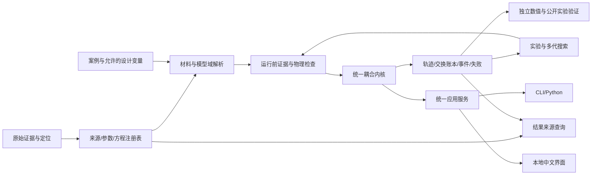

# ADR-SBX-001：可溯源的守恒烧砖沙盒内核与服务接口

状态：Proposed，供本 Goal 实现与物理审查使用；本文件不是实现、实验验证或验收通过证据。

范围：完整保留 `docs/BRICK_PHYSICS_PROJECT_SPEC.md` 中历史合同的 G0–G5 和第 11 节项目条件；当前执行使用独立阶段 Goal，包括原污泥、湿坯到冷却的厚度一维耦合、三个机制组的公开实验对照、真实多代搜索、CLI/Python/本地中文界面。制造解和探索情景只能帮助开发，不能替代来源完整的原污泥全周期案例。

本次只读核对了主 README、架构/公式映射/参数来源/限制、研究状态、材料方向与缺口记录、Goal 全文、B1 冻结合同/模型/示例、B2 推导/求解器/README、主 `common.py`/`l1.py`/`fvm.py`/输运/烧结实现及保存的 B2 失败状态。B2 当前失败产物记录全部 22 个情景完成积分而在 `current_audit` 阶段失败；仅这一状态还不能定位具体审计错误。失败根因和回归证据由基线修复工作另行记录，不在这里猜测。

## 1. 决策与整体结构

新增独立 Python 命名空间 `src/sludge_sandbox/`，保留 `src/sludge_vme/`、`experiments/material_dynamics_v2b1/`、`experiments/material_dynamics_v2b2/` 及历史产物。既有安装包可以暂时共同打包两个命名空间；新入口和 schema 明确标识新 sandbox，命令最终名称由统一应用服务确定并在使用文档固定。不沿用旧的 `synthetic_v1` 参数加载器或旧产品风险分数。

选择一个模块化进程内内核和本地运行服务。数值运算、来源核查、搜索与界面共享 Python 应用服务，不为 CLI 或界面复制方程；运行求解器置于可取消的独立工作进程。首轮并发为可配置的单 worker，后续依据实际单例耗时/内存扩大。无需微服务、外部数据库或云资源。



| 选择 | 收益 | 代价/限制 | 替代方案及取舍 |
|---|---|---|---|
| 新内核与旧研究隔离 | 防止 synthetic 默认值、历史 PASS、旧 schema 混入新域；可保留历史复跑 | 少量纯函数重复或需要窄适配层 | 原地改旧 L1 会把能量、氧气、几何与旧验证含义同时改变，不采用 |
| 固定参考控制体 + 当前几何 | 库存不因收缩被虚增；可在变形网格共享面交换 | 必须明确运动学和机械功 | 当前体积浓度直接积分容易漏膨胀/收缩项，不作为主状态 |
| 含生成能的总内能为主状态 | 组成、热容、相变、化学变化在同一储能定义中闭合 | 需温度反解和完整物种热化学数据 | 固定 `rho*cp*T` 加独立热源不能覆盖变组成；可保留作制造解 |
| 所有输运一次生成共享交换对象 | 物质流及其焓使用同一方向、面积、时间积分；内部交换严格抵消 | 接口比单独热/气脚本稍复杂 | 各模块各算边界损失会遗漏气体焓或重复供氧，不采用 |
| 严格证据模式 + 独立探索/测试模式 | 数值可先开发，研究结论有明确依赖和阻断 | 公开材料参数缺项可能阻止完整科学交付 | 用猜测值填补来源缺口违背 Goal，不采用 |

## 2. 模块、所有权与调用方向

以下文件为建议实现落点；最终实际路径在 `EQUATION_CODE_MAP.md` 映射，不能将本表当已实现清单。

| 模块 | 接口职责 | 不能做的事 |
|---|---|---|
| `schema.py`, `units.py` | 输入、SI 转换、基准、枚举、未知字段/非有限值拒绝 | 静默归一化错误配比；把未知值转 0 |
| `evidence.py` | 来源、参数、方程、派生节点；DAG/定位/许可/获取状态检查；结果依赖遍历，增长后再按职责拆分 | 将“有 DOI”当成“已读且适用” |
| `materials.py` | 干/湿基、元素/矿物/伪组分、原泥与灰身份、相关物性、绿坯初始化 | XRF 唯一反演矿物；独立优化密度/孔隙/渗透至有利极值 |
| `thermochemistry.py` | `u(T)`, `h(T,p)`, `cp/cv(T)`、EOS、温度/相态反解、热化学一致性 | 用纯物种库宣称已知多元液相 |
| `reactions.py` | 活跃计量矩阵、局部反应进度、正反向/耗尽行为、动力学参数组 | 使用边界累计供氧替代局部 O2；删掉未知挥发物质量 |
| `moisture.py` | 液水/水汽状态、饱和/毛细本构、蒸发/凝结、液水迁移 | 使用无来源单步 Arrhenius 代替全部干燥 |
| `transport.py`, `boundary.py` | 气体扩散、Darcy 压力流、液水流、导热、膜/对流/辐射；共享面交换 | 仅后处理计算压力；忽略载气；膜流与 Darcy 流双计 |
| `geometry.py`, `sintering.py` | 当前坐标/面积/体积、烧结内部变量、开放/闭合孔隙、渗透关系 | 截断孔隙到 epsilon 后继续假装全流程有效 |
| `mechanics.py` | 与几何相容的热/烧结应变、约束、应力、机械功；支持域报告 | 将温差、孔隙直接标作真实强度或开裂概率 |
| `state.py`, `kernel.py`, `solver.py` | 单一状态布局、组成状态解码、守恒残差、隐式时间积分、事件/取消 | 子模块自行更新库存或修改数值门槛 |
| `audit.py`, `validation/` | 从导出库存和交换记录重建质量/元素/能量；独立参考与实验对照 | 直接读取求解器自报 residual 作为独立证明 |
| `experiments.py`, `search.py` | 冻结模型快照、DOE/UQ/敏感性、多代谱系/复算/恢复 | 将数值失败等同材料不可行；混排探索与证据结果 |
| `artifacts.py`, `service.py`, `cli.py`, `web/` | 一个应用服务、原子产物、运行进度、中文界面与来源查询 | 在前端补物理公式、暗藏代理模型或产品合格阈值 |

依赖方向：注册表/材料 → 物理模型 → 内核 → 审计与实验 → 应用服务。物理模块不得 import 界面、搜索器或 artifact writer；无网络依赖的 `simulate()` 只读取已经解析冻结的材料包。

## 3. 主状态与控制体

选择随固体骨架运动的半板控制体，参考坐标 `X∈[0,L0]`，中心对称，外面暴露；非对称边界需使用全厚度模型，不套用半板对称条件。`V0_i=A0*ΔX_i` 固定。默认变量名称必须包含基准/单位。

每格主状态：

- `n_s_ref[i,s]`：每一固体/伪组分的摩尔库存，`mol/m3_reference_bulk`；伪组分必须有元素组成和一致的摩尔质量/热化学定义。
- `n_l_ref[i]`：液态自由水库存，同一摩尔基；化学结合水属于固体组分，不与自由水重复。
- `n_g_ref[i,k]`：气体库存，同一摩尔基。物种集合由所有活跃反应、初始气氛和边界气氛并集决定，必含实际载气。`N2` 不能只作为不入账背景；`O2` 必须局部积分。
- `U_ref[i]`：控制体总内能，`J/m3_reference_bulk`；含本模型保留的热化学、弹性和界面储能。宏观动能/重力能仅在量级判断支持时忽略。
- `z_sinter[i]`, `z_mech[i]`, `z_topology[i]`：烧结/力学/孔隙拓扑所需的独立内部变量；由材料模型决定具体维数。反应累计进度可作为诊断状态，不能再成为与物种库存不一致的第二份物质真相。
- 若运行闭孔模型，另有 `n_g_closed_ref[i,k]` 和闭孔体积状态；未实现/无依据时在开放孔模型适用边界停止。

派生量由一次 `decode_state()` 同步得到：`T`, `p_g`, `X_k`, `Y_k`, `rho_g`, `rho_l`, `S_l`, `phi_total/open/closed`, `J`, 当前 `x_faces/centers`、面积、应力和物性。不得再积分与库存无约束的独立压力或温度状态。

质量和元素：`m_ref=Σ_a M_a*n_a_ref`，`b_e_ref=Σ_a A_ea*n_a_ref`。所有初始凝聚态、液水和气体都入账。原料自带水按实际原料湿基转换，成型加水单列为 `kg_added_water/kg_dry_feed`，避免“总湿基含水率”和“额外加水”同时使用。

### 3.1 当前几何必须运动学相容

不要直接把每格 `J_i^(2/3)` 当作相邻格各自的独立公共面面积：空间非均匀收缩时，相邻格必须共享同一个面，且局部各向同性伸长一般不满足整块板的变形相容条件。

一维相容选择为 `x=x(X,t)`，共同横向伸长 `lambda_parallel(t)`，法向伸长 `lambda_n=∂x/∂X`，因此 `J_i=lambda_n_i*lambda_parallel^2`，公共截面积 `A=A0*lambda_parallel^2`。当前厚度由 `Δx_i=lambda_n_i*ΔX_i` 累加。自由、对称板由平面内力合力为零的力学闭合确定共同横向伸长；有约束时明确给定约束和反力，不把平面应变称作自由收缩。

初期均匀形变解析案例可用 `lambda_parallel=lambda_n=J^(1/3)`；这只验证均匀极限，不能自动扩为非均匀真实自由砖模型。自由板的小弹性应变和有限烧结本征收缩可分解处理，材料本构和忽略的剪切/翘曲范围在世界定义中明确。

用物种的当前部分摩尔体积计算凝聚体积。以参考总体积为基准：

```text
v_s_ref = sum_s(n_s_ref * vbar_s(T,p,phase))
v_l_ref = n_l_ref * vbar_water(T,p_l)
v_pore_total_ref = J - v_s_ref
v_pore_open_ref = v_pore_total_ref - v_pore_closed_ref
v_g_open_ref = v_pore_open_ref - v_l_ref
phi_open = v_pore_open_ref / J
S_l = v_l_ref / v_pore_open_ref
c_g,k = n_g,k_ref / v_g_open_ref
p_g = R*T*sum_k(c_g,k)                 # declared ideal-gas domain only
```

密度、孔内浓度、气体压力、传递距离、面积全部使用同一组量。自由水必须占据孔体积；不允许既用干态全孔容计算气体浓度又在同一体积放液水。`v_g_open_ref<=0`、`v_pore_total_ref<0` 或来源定义的连通性边界均触发结构化域错误或已实现的相态切换，不能 clamp。

## 4. 物种、反应与面交换的守恒离散

令 `N_i,a=V0_i*n_i,a_ref` 为控制体实际摩尔数。反应计量矩阵 `nu[a,r]` 必须在加载时验证 `A@nu=0` 及 `M@nu=0`（同一原子量基准）；相变 `H2O(l)↔H2O(g)` 同样是成对库存交换。所有反应使用一次计算的进度 `R_i,r`，单位 `mol_extent/s`：

```text
dN_i,a/dt = F_i-1/2,a - F_i+1/2,a + sum_r(nu[a,r] * R_i,r)
```

`F_f,a` 是当前整个公共面的有符号摩尔流率 `mol/s`，全域统一朝 `+x` 为正；固体在骨架控制体中不发生平移穿面，自由液水和气体才有相对穿面流。累加各格时内部面完全抵消，外面正流是排出、负流是流入。所有组分包括惰性载气都保存实际初始库存和边界双向累计流。

反应速率的物理基准必须注明为“每 kg 原料”“每 m3 当前固相”等，并且只在适配器中转换到 `mol_extent/s`。`A,E,反应模型,产物分配,气氛,材料批次` 是不能拆散的动力学参数组。空气氧化、惰性热解和碳酸盐/脱羟分别建路径；原泥未知挥发物不能整体写成任意化学式的“VOC”后宣称元素/能量闭合。

局部氧化消耗只依赖局部 O2 和实际流入，库存耗尽后速率模型需有正性不变域；不从给定膜系数的时间积分预支氧气。密闭极限和有限库氧上界由完整库存推导，开放无限库是有限供氧速率而不是有限供氧总量。

### 4.1 气体扩散与 Darcy 流必须使用一致的参考速度

第一种可实现模型为“适用域受限的混合平均扩散 + Darcy”。采用质量平均气速，Darcy `u_D` 定义为气体相对骨架的表观体积通量 `m/s`；其已含气相体积分率，不再额外乘一次 `phi_g`：

```text
u_D = -(K * k_rg / mu_g) * (grad(p_g) - rho_g*g_x)
j_k_star = -rho_g * (M_k/Mbar) * D_k_eff_X * grad(X_k)
j_k = j_k_star - Y_k * sum_j(j_j_star)       # sum(j_k)=0, mass-average frame
F_g,k = A_face * (rho_g_face*Y_k_upwind*u_D + j_k) / M_k
```

`D_k_eff_X` 是适合摩尔分数梯度、按总体截面积定义的有效混合平均扩散系数；不能混入质量分数梯度系数或再重复乘孔隙/曲折度。若使用 `grad(Y)` 形式，必须采用对应系数与独立模型 ID。混合平均扩散的零质量通量修正与所用系数约定可核对 [Cantera 的 Diffusive Fluxes 章节](https://www.cantera.org/stable/reference/onedim/governing-equations.html#diffusive-fluxes)。这里采用的是参考系与形式约束，不表示该文档给出了污泥的有效扩散系数。

膜边界使用同一传质模型的界面未知量，半单元与膜阻力串联；外界压力、组成和温度为库状态。不要给每种物种独立吸收边界并同时再按同一压差追加总排气量。气体反向进入时携带边界来源的组成和焓。有限外库必须积分其气体库存及能量，不每步重置；若恒温库作为外部控温系统，其控温热量另入库账本。

上述模型的 barodiffusion、Soret、Knudsen、非理想性等遗漏要由孔喉尺度、温压与混合组分评估。`d50` 不是孔喉半径。若压力梯度/孔道尺度需要更完整输运，提供 `DustyGasTransport` 适配器并替换整套气通量；DGM 已包括的黏性贡献不能与额外 Darcy 重复相加。仅有一份软件教程不足以批准材料域。

### 4.2 干燥不是单一化学反应开关

液水相可以采用有适用证据的毛细压力—饱和度关系和相对渗透：`p_l=p_g-p_c(S_l,T,material)`，`u_l=-(K*k_rl/mu_l)*(grad(p_l)-rho_l*g_x)`，`F_l=A*rho_l*u_l/M_water`。这需要来源支持的保水/毛细和渗透关系；缺项不能从土壤或普通建筑墙体关系直接冒充湿污泥砖。

蒸发/凝结接口支持两种互斥模型：

1. 有适用性证据的局部相平衡：在总水与总内能固定约束下联立温度、液水量、蒸汽量和来源定义的水活度/饱和关系；湿/干切换用互补条件和耗尽事件，不能凭空选择蒸发速率。
2. 有界面面积、速率和有效域证据的非平衡相变：使用成对 `(-R_evap,+R_evap)` 库存源，允许凝结；正向受液水库存约束，反向受蒸汽库存和域约束。

水物性和饱和关系的有效温压区间必须检查；失去液水稳定域后不能继续外推液态水常密度模型。吸附水/毛细水、化学结合水与自由水依材料证据区分。软件文档中明确同时列有液水运动、扩散焓与相变的热湿耦合项，见 [COMSOL 热湿多孔介质理论说明](https://doc.comsol.com/6.3/doc/com.comsol.help.heat/heat_ug_theory.07.086.html)；该页面仅用于机制覆盖核对，不用于导入未读图式的数值或材料常数。

## 5. 完整能量：一个储能定义，一套交换

本 ADR 选择总内能含化学生成能和相态差异的约定；不是只积分显热。在每格：

```text
U_i = sum_all_species(N_i,a * ubar_a(T,p,phase))
      + U_elastic_i + U_interface_i
```

在一致参考态下，理想气体 `ubar_k=hbar_k-R*T`；凝聚相使用本模型相应的 `u=h-p*vbar` 与热膨胀/压缩性近似，不能把气体公式直接用于固相。`cp(T)` 积分、生成焓、相变及固相转变必须来自相容的热化学数据。为效率允许按相同元素参考基准整体移除不影响反应热的能量常数，但只能对全部物种一致变换并记录。

`T=temperature_from_internal_energy(U,N,geometry,internal_variables)` 必须在当前活跃物性有效域内求根，检查热容量和单调性。组分变化后重新反解温度，所以：

- **反应改库存，不再向总内能方程加 `-DeltaH*r`**。否则生成能下降与显式放热会重复。
- **蒸发改液水/水汽库存，不再另加潜热热源**。相态内能差已经包含蒸发吸热；可输出分解后的热效应作诊断，但不能再次积分。
- 若来源仅提供总反应焓，允许依据计量/Hess 关系导出缺少的伪组分参考能；必须证明方程组可识别、各路径热效应相容并记录派生 DAG。单有燃烧热不能唯一确定热解产物分配及每个产物能量。
- 接入含液相的热力学数据库后，相分数变化同样在物种/相态储能中处理。不能在相分数热容中包含潜热又另加相变热。

当前公共面能量流率与物质流一起定义：

```text
F_E_face = F_conduction_face
           + sum_gases(hbar_k_face * F_g,k_face)
           + hbar_liquid_face * F_l_face
dU_i/dt = F_E_left - F_E_right + Wdot_on_i
```

对流体体积流动采取上风流入状态的焓；扩散焓使用与面离散一致的物种面焓，同一面两侧绝不各算一次。外面传热为对流加灰体辐射的实际面积热率，炉气温度和炉壁温度独立。选择总能量流后，不能再额外加一个“气体冷却”经验项。包括未反应 O2、N2 和流入水汽的焓，而不只包含 CO2 的排出焓。

开放控制体总内能包含流入/流出焓与体积功的第一定律形式可核对 [Cantera Control Volume Reactor，Energy Equation (4)](https://cantera.org/stable/reference/reactors/controlreactor.html#energy-equation)。将其推广到这里的多相变形格点需要本节明确的控制体/应力功约定；该零维页面本身并不是多孔砖模型的验证。

`Wdot_on` 必须由同一几何/力学模型提供：包含保留的应力功，内部机械交换共享面牵引和骨架速度；全体求和后只留下外部机械功。仅当完整应力/边界条件确实退化到均匀压力做功时，才可用 `-p_ext*dV/dt`，不能每格直接取孔压乘总体收缩并再叠加外部压力功。流动功已由物质焓包含，不再次加一遍。

烧结的界面自由能降低、弹性储能和黏性耗散需要一致处理：若保留相应储能，其变化反映在温度反解；若将它们视为微小，先输出基于材料参数和本运行状态的独立量级界限，与验证误差预算比较并在世界定义说明。不能为了“完整能量 PASS”在没有量级依据时把机械/界面项定义为不存在。宏观动能、重力势能与气流黏性功等任何忽略项同样登记。

独立审计必须从所有时间段的 `N_i,a` 和热化学函数重建 `U_i`，加上公开声明的储能项，再与分别记录的热边界、每种气/液的焓流、机械功积分比较。不能由已生成的 `U_final-U_initial` 倒算一个边界热量，再证明两者相等。

## 6. 烧结、连通性与冷却力学的闭合边界

烧结插件消费局部温度、相/物种、孔隙、内部变量与应力，返回内部变量速率及来源依赖；几何插件由运动学/本构求得变形。支持的模型形式可包括来源约束的黏性烧结、限定温度/时间/材料域的收缩动力学；两者都需要实际材料参数，均不能称为普适第一性原理。

孔隙总量由凝聚体积和总体积推导。开放到闭合的分配需要独立连通性模型，渗透率依赖该分配及材料结构；不要同时把烧结几何缩小与独立“孔隙衰减”相加。闭孔出现时，若有证据模型，将捕获的物种和内能按同一个拓扑交换账本转入闭孔状态，并计算其压力；否则在已登记的模型适用边界停止并保存最后有效状态。停止代表该候选尚未完成全周期，不能以剩余时间直线外插结果。

冷却沿用同一能量和几何内核。应力来自有支持的热膨胀、本征烧结收缩、弹性/黏弹性、本构温度域及机械边界。均匀自由冷却、受限热胀和非均匀厚度场应有不同结果；不能用恒定 `E*alpha*DeltaT` 给所有工况相同的“应力”。材料有重要相变时必须纳入相应应变/热效应或限制域。

真实抗压强度、破坏概率、鼓胀阈值、合格吸水率、翘曲等均有各自 `OutputSupport`。开放孔隙和水密度导出的“完全可达孔隙饱水容量”只能称该假设下的容量，不等同标准吸水率试验。力学模块为必需实现；某材料力学证据缺项时输出 unknown，并在完整材料域验收中保留相应科学缺口，不能删掉力学接口来完成 Goal。

## 7. 可直接实施的接口合同

下面是接口草图，不是运行代码，也不是完成证明。类型应为不可变数据对象；数组单位和布局在 schema 固定。

```python
class EvidenceRegistry:
    def resolve_material(self, material_id, requested_domain, mode) -> MaterialResolution: ...
    def resolve_models(self, model_ids, material, outputs) -> ResolvedPhysics: ...
    def trace_output(self, run_id, output_id) -> ProvenanceSubgraph: ...

class MaterialResolution:
    material_identity: MaterialIdentity
    parameters: tuple[ResolvedParameter, ...]
    missing: tuple[EvidenceGap, ...]
    applicability: tuple[ApplicabilityDecision, ...]
    lane: EvidenceLane

class Thermochemistry:
    def internal_energy(self, inventories, temperature, geometry, internal) -> EnergyBreakdown: ...
    def decode(self, conserved_state, geometry) -> ThermodynamicState: ...
    def enthalpies(self, temperature, pressure, phases) -> SpeciesEnthalpies: ...

class FaceExchange:
    gas_mol_s: Array[species]
    liquid_water_mol_s: float
    conduction_W: float
    material_enthalpy_W: float
    mechanical_power_W: float
    equation_ids: tuple[str, ...]

class ReactionExchange:
    extents_mol_s: Array[reaction]
    stoichiometry: Array[species, reaction]
    evidence_ids: tuple[str, ...]

class Kernel:
    def residual(self, old, trial, dt, boundary, models) -> CoupledResidual: ...
    def audit_state(self, state) -> StateChecks: ...

def simulate(request: SimulationRequest, *, registry, budget, cancel) -> RunOutcome: ...
def run_experiment(plan: FrozenExperiment, *, runner, budget, cancel) -> ExperimentOutcome: ...
def compare_runs(run_ids, metrics, *, required_lane) -> Comparison: ...
def trace_result(run_id, output_id, *, artifact_store, registry) -> ProvenanceSubgraph: ...
```

`FaceExchange.mechanical_power_W` 只是共享机械交换的一部分；包含横向功的降维模型可返回单元功项和对外合力功的单独账本，最终审计按第 5 节同一世界定义重建，不能丢掉平面外边界。

`EvidenceGap` 至少包含 `dependency_id`, `reason_code`, `affected_outputs`, `attempted_sources`, `required_domain`, `next_evidence_need`。`ResolvedParameter` 至少含 value/function、unit、basis、source type、upstream IDs、定位、转换版本、适用性决定和不确定性依据；生成工厂材料名称并不能补齐这些字段。

### 7.1 Fail-closed 运行决策

`SimulationRequest.mode` 必须显式区分 `evidence_constrained`, `exploration`, `manufactured_verification`。分类取所有活跃依赖的最弱支持，不由用户自由把输出标签升级。

1. 先解析本次完整热历史/材料/几何所需机制、所有物种和输出的传递依赖。
2. 检查来源 ID、无环派生、实际阅读、具体定位、单位与基准、原始证据身份、材料域、模型域、转换记录和关键值齐全。
3. `unknown` 本身仍保持 null。探索替代值必须是单独、明确的探索假设节点，与原 unknown 关联；不可修改原材料包为“已知”。制造值从任何入口进入即保持 manufactured lane。
4. 核心动力学/热化学/毛细/烧结等依赖未知时，证据模式拒绝创建完整预测，保存 `evidence_blocked`；可独立完成不依赖它的验证任务。未知产品指标可不计算，但不能用默认 0 进入排名。
5. 每步重新检查状态相关域，进入未覆盖温区、孔道状态、气氛等返回 `domain_exit`，保留已完成区间，不生成成功全周期标签。
6. 结果图依赖实际启用的模型、参数及其上游；改变一个渗透率来源应同时改变压力、反应、温度等全部下游支持状态。只按报告标题列参考文献不满足这一要求。

`RunOutcome` 分离 `execution_status`（completed/cancelled/resource_limit/numerical_failure/evidence_blocked/domain_exit）、`numerical_status`、`scientific_status`、每个 `OutputSupport` 与 `deployment_status=offline_research`。有效运行的“事件未在时限内发生”和“氧预算不足以达到诊断事件”另列，不当成 solver failure；失败也不直接判为材料不可行。

来源覆盖比例的分母是实际参与当前预测的全部物理依赖；虚拟设计量与数值政策分列，不能充作实测覆盖。来源完整、域匹配、分机制验证、整块砖耦合验证分别保存，禁止一个 PASS 混合。

## 8. 耦合求解与数值验证顺序

建议先实现可审核的单体隐式有限体积步，再基于测量成本优化。Backward Euler + 自适应步长/一步两半步误差估计是起点；质量/元素线性守恒由同一残差中的化学计量和共享面自动保持。时间二阶方案可随后加入，但必须有收敛和同权重交换账本，不能只替换求解器名称。

每个非线性试探步骤都进行组成/能量反解 → 几何/孔隙 → 物性 → 热湿/气通量 → 化学/烧结/机械 → 完整残差；所有依赖使用该试探状态。阻尼 Newton 只接受正库存/有效温度/孔容的可行试探，越界通过线搜索/拒步减半处理，不能 clip 或事后归一化。严格零库存要可表示，不能统一使用 log(n) 后把零改成 epsilon。零消耗物种、相变互补条件和首次产物出现必须有专门的活跃集/单边导数策略。

面导热/扩散系数用半格阻力组装；非均匀网格与系数跳变有通量连续性测试。Darcy 对流起步用保守上风以保护库存，量化其数值扩散；不能把网格造成的燃尽提前当作改善。边界程序转折、输出点和事件需精确分段，防止跨温度节点跳步。

每个接受步原子记录状态、实际积分的热/物质/机械交换增量与步信息，保证取消/中断后能从最后完整步恢复。半步误差估计采用两半步结果时，只累计这两半步账本，不再叠加被丢弃整步。恢复必须验证模型/注册表/材料/输入/随机状态一致；模型变化创建新运行。

最低验证层次及其作用：

| 构建顺序 | 必须实际实现/运行 | 独立证明什么 |
|---|---|---|
| V0 | 单位/基准、物种矩阵、初始湿坯孔容、来源阻断 | 无重复水、错基准、未配平反应和假证据 |
| V1 | 封闭绝热无反应、不同 cp/生成能的封闭反应、两格物质交换 | U 定义、反应热不重复、物质焓交换与参考能不变性 |
| V2 | 惰性导热解析解、无反应多组分扩散、均匀密閉气体压缩 | 空间/时间误差、载气质量、压力与功闭合 |
| V3 | 液水/水汽蒸发凝结极限与有限氧密闭/开放反应 | 潜热不重复、耗尽正性、局部 O2 库存和边界方向 |
| V4 | 有限压差 Darcy、等压扩散极限、湿润/干燥的相反迁移 | 压力确实改变流量；膜阻力与内部阻力未双计 |
| V5 | 已知形变映射的制造解、开放转闭孔事件、自由/受限冷却 | 面积/距离/J 一致，孔道停止诚实，力学边界有效 |
| V6 | 全周期集成 + 多网格/多步长 + 各阶段账本 | 完整耦合与最坏时段误差；不是只起终点抵消 |
| P1–P3 | 公开干燥/传热、原泥反应/残碳、烧结/收缩数据 | 各材料/气氛/几何域的现实对照 |
| P4 | 未参与拟合热历史/材料/批次的留出检查及成对耦合证据尝试 | 外部预测能力和实际独立层级；失败/缺项如实保留 |

误差门槛必须在看结果前登记；不同库存/能量字段用物理尺度归一化，不拿可能互相抵消的巨大生成能当唯一分母掩盖显热误差。每步/各阶段与全程的最大质量/元素/能量误差分别报告。数值分析、制造解、同内核重放不算公开实验对照。

## 9. 实验、搜索、应用与运行产物

实验冻结对象包括软件 commit、世界定义、材料/来源/参数派生包、物理模型形式、允许设计变量、目标/约束来源、随机种子、候选谱系、数值配置、资源预算和停止标准。模型升级另起 experiment，不混用前代分数。

候选生成只修改现实操作或明确探索决策，并通过材料构成关系同步更新绿坯/粒径/水/孔隙相关物性。初期 DOE 与敏感性确定活跃变量，再执行带父代选择、交叉/变异或其他真实后代产生机制的多代过程；保存未改善和失败，不能为“每代更好”改结果。证据结果、探索结果、制造验证目录及比较器严格隔离。

目标以温差、局部残碳、实际净气体流、支持的收缩/尺寸、单位砖净热输入和已支持的力学量为主。净热输入不等于窑炉燃料消耗。无依据产品指标为 null。被选候选用更细网格/时间步和冻结的独立验证/模型形式情景复算；稳健排名只在支持相同的候选子集中比较。

运行目录建议为 `runs/sandbox/<lane>/<experiment>/<run_id>/`，含：

- `resolved_input.json`, `world_snapshot.json`, `provenance_graph.json`, `versions.json`。
- `state.npz` 或等价无损数组、`state_schema.json`、可读 CSV；字段含相/物种/单位/基准/当前坐标。
- `face_exchanges`、`step_ledger`、`events.json`、`conservation.json`、`output_support.json`。
- `status.json`、中文 `report.md`、实际资源测量、最后成功 checkpoint；失败也生成同类状态/依赖证据。

真实审计实现应能只读这些主库存/交换记录和冻结材料函数重算，不依赖求解器内存中保存的 residual。文件 hash 提供身份一致性，重放提供同模型可重复性，公开实验提供现实支持；三个层次单独报告。

应用服务建议动作：`validate`, `sources check/query`, `simulate`, `batch`, `uq`, `sensitivity`, `search`, `replay`, `export`, `resources`, `serve`。Python 与 CLI 同一个 `SimulationRequest`/`RunOutcome`；中文界面通过同一 service 选择材料/案例、编辑允许决策和温程、启动/取消/恢复、比较曲线/剖面、显示 unknown 和失败、点击量名获得完整来源子图。界面按钮不能忽略证据阻断并自行换用 synthetic 案例。

本地运行服务仅监听回环地址，跨界输入仍做 schema/路径验证，不提供任意 shell 或任意远程下载端点。下载来源与缓存准备是显式数据准备步骤；求解本身离线。运行预算、取消和失败的交互必须实测，不能仅证明首页能打开。

## 10. 旧组件的复用/替换决定

| 现有组件 | 可复用的内容 | 新内核必须改变/重新证明 |
|---|---|---|
| `chemistry/formula.py`, `units.py` | 元素公式解析/基准转换的窄纯函数及测试思想 | 逐项核对原子量来源、支持元素、湿基语义；禁止带入 synthetic material 默认值 |
| `models/fvm.py` | 参考库存转当前孔浓度的思想、共享面望远镜守恒、稀疏结构 | 增加液水占孔容、载气/O2、压力流、物质焓、相容面积；旧 `J^(1/3)` 面因子仅在其运动学假设内成立 |
| B1/B2 solver 与 oracle | 共享反应进度、有限库反向交换、无 clip 拒步、独立解析测试 | 无量纲固定孔体积/同 D 等摩尔 C/O 模型不能成为全气体/变温/变形内核；B2 失败单独定位 |
| `common.py`/`l1.py` 温度与氧气路径 | 边界程序与基本网格组织作为参考 | 旧 O2 不在 `GASES` 局部场，预先累计边界供给不能代替真实 O2 输运；固定 `rho_heat*cp` 方程和末端能量恒等式必须替换 |
| `physics/transport.py` | 量纲检查、Kozeny–Carman 等候选本构函数形状 | 系数、孔结构域和适用性重新取证，不把默认 180 当当前材料事实 |
| `physics/sintering.py` 与 `liquid_fraction()` | 仅保留历史研究复跑 | 旧温度 sigmoid、默认 A/E、温度/粒径 clip、未知强度/压力分数不得进入新证据域 |
| `thermo/*` | 缺少相/数据库时拒绝或标缺项的接口思想 | 纯相制造解不能代替氧化物液相库，材料/相函数适用性必须重新核查 |
| `uq`/`inverse` | 确定性种子、设计 ID、Pareto 算法可窄复用 | 旧 policy 不是统计分布；旧 12 维自由物性/合格约束不可照搬；必须增加真实父子代、失败区分和重新评估 |
| `io/manifest.py`, artifacts | 原子写入、版本/文件完整性和回放接口思想 | 新 schema 与新状态独立；不把旧 replay 容差/批准直接迁移，不优先扩展复杂 hash 框架 |
| DTU 原始数据/研究 | 原始表、许可、物种身份、单元格来源、SSA 的限定终态对照 | 不当原泥/空气动力学，不把小圆片终态数据当完整整砖过程验证 |

不使用 wildcard 方式将旧模块打包导入新内核。任何直接复用纯函数需要窄适配器、双向单位测试和依赖检查；默认材料包必须由新 registry 显式解析，不能 `get(..., synthetic_default)`。

## 11. 立即构建顺序与保留的科学阻塞

1. 固定世界状态/单位/来源缺项 API 和证据 lane；建立最小湿坯库存与气体载气初始化，不等待完整公开资料。
2. 在 manufactured lane 实现总内能/共享面/反应残差，完成封闭两格与温度反解的独立验证，同时从公开证据逐项补实际热化学/材料包。
3. 实现含局部 O2、液水/水汽的热湿反应输运，实际做质量/元素/能量与正性验证。依据实际尺度选择混合平均 + Darcy 或 DGM，不用只后处理压力的路径。
4. 接入相容几何、证据支持烧结、连通性/闭孔边界与冷却力学；完成全周期和多网格验证。
5. 对三个必需机制组分别登记/运行公开实验和真实留出预测，尝试成对耦合对照；失败反馈模型或材料域，保留原门槛和失败证据。
6. 在统一 service 上接 CLI/本地界面与来源跳转，完成 DOE/UQ/敏感性、多代搜索、取消恢复和候选复算。
7. 从干净锁定环境实际跑完整命令链和界面流程，按完整 Goal 验收，不以本 ADR 中的 manufactured 阶段代替最终要求。

截至本设计，当前仓库公开证据本身尚未证明一个包含原污泥的完整材料包：原泥热解/氧化产物分配及热化学、湿坯热湿本构、动态烧结/连通性/渗透、力学与它们的共同材料适用域都需逐项核实。不能从几篇不同污泥/黏土研究各取一个参数后把拼接体称为实测材料。可以用明确论证的跨域关系与不确定性模型，但必须实际证明适用性并在结果中保留这一推断。

以上缺口不阻止软件与制造验证持续建设，却会阻止“来源完整的原泥全周期科学模型已完成”的声明。第 11 节 Goal 完成条件保持原样：最终至少一个真实定义的原泥材料域、完整关键来源和适用性、全周期、数值账本及三个机制组现实对照均必须有实际产物。

## 12. 本 ADR 的来源使用记录

本次核读的外部资料只用于接口/守恒结构核对，不作为任何污泥材料常数的来源包：

- Cantera 3.2，Control Volume Reactor，Energy Equation (4)：开放控制体 U、热、流入/流出焓和体积功的约定；链接见第 5 节。网页已读，未把该零维模型称作砖体多相求解器。
- Cantera 3.2，Governing Equations for One-dimensional Flow，Diffusive Fluxes：混合平均系数对应的梯度/参考速度和零质量通量修正；链接见第 4 节。未采用其燃烧流边界作为砖体边界。
- COMSOL 6.3，Theory for the Moist Porous Media Version of the Heat and Moisture Transport Interface：已读可提取文本中的热湿耦合项，图片公式未作数值取参；链接见第 4 节。不是湿污泥砖材料适用性证据。
- [NIST-JANAF SRD 13](https://janaf.nist.gov/)，DOI `10.18434/T42S31`：本次只核读数据库入口与版本元数据；具体物种表仍须逐项读取并进入来源注册表，不能根据入口声称数值已验证。

本 ADR 中的参考体积离散、几何相容与接口分层是明确列出的设计推导，须经独立物理/数值审查和实际测试；它们不自动成为新的实测或已接受本构资料。
