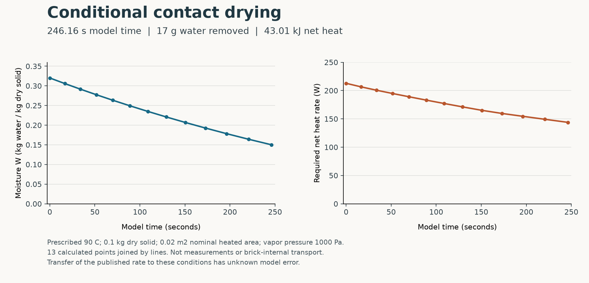

# 颗粒段接触干燥：来源速率与能量动态验收

本阶段从641377f继续，把真实出版的去水速率式接到了同源湿态焓模型。**已完成一条有时间坐标、排水量和净热负荷的条件探索路径；它尚不是砖坯内部干燥或完整烧成模型。**

图中左侧为干基含水率，右侧为维持90°C料温所需的净热功率。13个点来自本次保存的实际计算结果，连线用于展示，未画实验误差条。下载：[矢量图](CONDITIONAL_DRYING.svg)、[PDF](CONDITIONAL_DRYING.pdf)、[原数值CSV](CALCULATED_POINTS.csv)。

## 本次实际结果

设计输入为0.1kg干物、0.02m²名义受热面积、恒定料温90°C、外部维持水汽分压1000Pa、总压/液压1bar，W从.32到.15。A与原文通量采用同一归一化基准，没有额外接触覆盖率。装料、面积、温度和气相均为显式设计条件，不能称为原试验工况。

| 量 | 结果 | 解释/原验收门槛 |
|---|---:|---|
| 模型时间 | 246.155847611s | 含b质量ODE的解析时钟；独立60位Decimal比较≤1e−9s |
| 排出水量 | .017kg | 干基W差乘干质量；局部与累计质量门≤1e−12kg |
| 净供热需求 | 43006.742625222J | 原q95分段积分加同源水参考的温度修正；不是工业燃料耗量 |
| 签名流出水汽焓 | −226127.079654532J | 共同能量参考下的值，负号保留 |
| 瞬时净热功率 | 212.820892→143.832066W | 为维持指定料温所需的条件热负荷 |
| 最大反解温度偏差 | 6.265e−11K | 原门槛1e−6K |
| 最大相邻恢复态能量残差 | 3.010e−8J | 原门槛1e−5J |
| 最大全前缀能量残差 | 1.677e−8J | 原门槛1e−5J |
| 最大保存水账残差 | 3.470e−18kg | 原门槛1e−12kg |

模型首先积分每段所需净热与带符号的流出焓，更新总H，再通过已有湿态模型实际反解T。没有用指定料温覆盖反解结果，也没有把源总解吸热之外再加一遍汽化热。省略b的纯算术负对照给396.694085s，与当前解析时钟相差150.538237s；重复计汽化热的负对照破坏原能量门槛，残差约−38976.582J。两项控制均未重跑物性。

唯一native01的13观察和369项预登记检查通过：API运行5.063229208s、完整driver5.119490000s、进程监督10.250868209s；分别小于原30/60/80秒限额，清理宽限5秒未变。外层385项输入前后相同，退出0，leader已回收。exec36266已经终态，不应重复轮询或覆盖重跑。

## 来源和适用性

真实出版依据为Arlabosse、Chavez、Prevot2005的Eq3和其后系数说明，DOI [10.1590/S0104-66322005000200009](https://doi.org/10.1590/S0104-66322005000200009)。a=34.38kg干物/(m²h)、b=4.58kg水/(m²h)是作者估计系数，拟合残差与实验误差未给。原打印域W=.05–.32，与当前湿热共同研究域只有.15–.32。来源登记见`data/sandbox/research/arlabosse-granular-drying-v1/source.json`；原件位置、读取状态及矛盾见[SOURCE_FINDINGS.md](SOURCE_FINDINGS.md)。

原Eq6没有b，不能作为含b的Eq3和守恒式的解。本实现保留b并重新推导质量ODE解析解，明确属于派生修正，未冒称作者勘误。原工业过渡点对应含水率超过Eq3打印上界的事实也保留，没有为了复现原工业曲线修改面积、过渡点或系数。

外部水汽分压低于全路径模型平衡分压，是支持所设蒸发方向的必要条件。源速率对本例料温和气相条件的迁移误差、原工况对应和实验误差仍为unknown；这条轨迹不取得实测干燥时间的验证资格。来源Cp/q/水参考构成可追查的热力学关系，不能因此把接触干燥器通量等同于砖内扩散系数。

## 软件与复现

动态Python入口和完整状态/输入定义见[IMPLEMENTATION.md](IMPLEMENTATION.md)。输出采样取12个含水间隔，解析求得各时刻；改变报告采样不构成ODE时间步收敛试验。

源码26项制造测试通过；两项独立代码审查分别41项通过（各26项仓库测试与15项独立探针）。发现并修复了正数下溢却完成、可表示时钟的中间乘法溢出、收尾超时/取消漏判、次正规数温度偏差被零能量残差掩盖等问题。原RED与中间结果保留；温度/能量/水量有独立接受门，失败候选先保存再拒绝，不能进入已接受行。

171包文件（164个Python模块）在源码冻结与非editable安装之间逐字一致；隔离安装82项相关回归通过0.17s。安装01因默认缓存权限失败，02因该缓存缺wheel失败；指定已存在的`/private/tmp/brick-sandbox-uv-cache`后离线INSTALL03成功，没有修改模型依赖版本或科学门槛。前两轮测试收集误选旧安装包的日志也保留，不能称为新源码的物理失败。

保存结果的独立复核588项全部通过，未重跑模型或EOS。复算覆盖局部与累计水量/能量、原源系数解析时钟、实际逆解温度、385项输入和171包文件，以及CSV的13行130个数值。首次复核误读冻结文件结构，属于审核脚本错误；原FAIL与修正记录一并保留，没有修改模型或门槛。

图像仅由保存RUN.json生成，未调用EOS；Matplotlib3.11.2安装在独立绘图环境，物理环境未改。原字体缓存警告保留，实际PNG已查看，文字和轴线没有裁切；PDF/SVG/CSV同时生成。图脚本是本次冻结输入的报告脚本，不是通用应用运行入口。

本次仍只有动态Python接口，没有新增CLI/中文运行路由。源论文私有原图未再分发；原数值、安装/源冻结、研究协议、代码/物理审查、实际运行和后续保存复算保存在证据归档中，共93个成员、762,641字节，已全部重开核SHA；具体成员见[EVIDENCE_MANIFEST.json](EVIDENCE_MANIFEST.json)，[证据归档](evidence.tar.gz)。私有原图/HTML及测试临时副本、绘图环境和缓存均未归档。

## Goal仍需完成的范围

本增量提供同源污泥预处理的条件时间尺度和热功率耦合。它没有补齐单块砖内部的导热/扩散/毛细本构、完整反应库存与反应热、烧结/连通性和材料冷却应力。三个机制的现实验证、原泥全周期、多代实验和完整应用验收仍按原合同继续；材料/训练/全周期资格全部为false。
