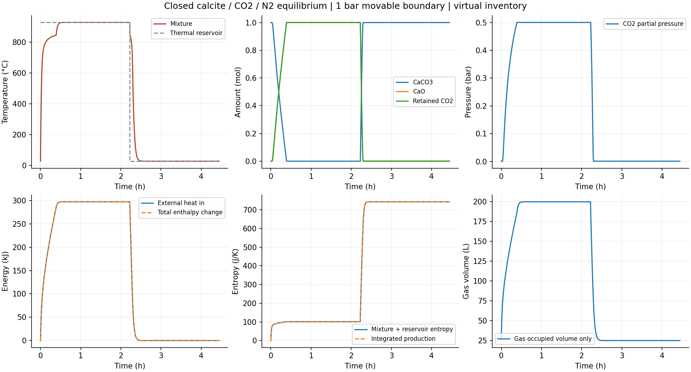

# 有限CO2库存下的分解与再碳酸化

完成1bar总压、封闭物质、1mol方解石/1mol N2/0.001mol初始CO2的理想平衡热循环。两档16000s过程、固定温度核算、完整热量/元素/熵核查都通过预定预算。气体保留在系统中，分压、气体储热和混合熵共同反馈反应平衡。此能力仍是明确虚拟库存的等压可动边界装置，不是定体积砖孔，也未验证有限化学速率。

氮气的同源物性来自[USGS Bulletin 2131](https://pubs.usgs.gov/bul/2131/report.pdf)打印p42、p97（PDF第48/103页），两页已经实际查看并保存为source目录PNG。11温点的Cp、绝对熵、显焓/T最大打印差分别0.00475889、0.00496759、0.00486849 J/(mol K)，均在打印算术包络内；独立Cp与Cp/T积分差≤7.276e−12J/mol、2.132e−14J/(mol K)。打印包络不是现实物性误差条。

11个静态状态独立用反应量根求平衡，和显式分压解差≤2.082e−14mol；焓反解温差≤5.116e−12K，dH/dT差≤2.627e−6J/K，dS/dH与1/T差≤8.621e−13/K。Ca/C/O/N库存、正有效热容、局部自由能极小和纯相化学稳定性通过。

共存边界为834.974808097K和1117.024805119K；产生的CO2留在气体中，使分压从99.90010Pa升到约50024.98751Pa，反应沿一段温度范围变化。紧容差升温开始/完成反应为105.373868658s和1402.997084010s；冷却开始/完成再碳酸化为8012.397995015s和8271.481645546s。另用独立反应量根、隐式平衡导数及Cp/Q积分得到四个时刻，误差≤2.364e−8s。

紧容差全程能量账≤2.89210e−7J、熵账≤2.52821e−8J/K，元素残差≤6.679e−16mol。二/四点独立积分局部焓≤1.50867e−6J、累计熵≤5.352e−9J/K；最小单步组合熵−4.141e−12J/K，在原1e−10数值容許内。两档8001共同时刻温差≤1.73701e−7K、反应量差≤2.92781e−11mol、事件差≤1.58530e−7s。气体分压/体积差有记录，未另声称未设预算的现实精度。

加热吸热297270.857350J，冷却移除同量热；总焓包含固相和气体，没有重复添加反应热或外排CO2流焓。整体熵增加约743.177143375J/K。冷却最后全部Ca重新为方解石且气体回到初始CO2/N2库存，是瞬时平衡极限，不能断言实际石灰在这个时长内完全再碳酸化。

图已打开核读。气相占据体积约24.97L初态、199.65L热终态，体现虚拟活塞装置；图中体积绝不作为砖膨胀/收缩或孔隙率预测。两条轨迹gzip分块解压逐字节一致，记录与参数已保存；没有软件测试或SHA操作。

第一次完整审查在JSON保存时遇到NumPy布尔类型错误，原review.json是未完成前缀，review.stderr.txt保留堆栈；只改为原生bool后重新执行，正式完整结果为review-serialized.json。没有放宽预算或删除失败证据。

下一步可独立推进：把总碳库存从常数改为可输运状态，连接两个等压单元，验证CO2迁移、反应重分配、流焓与热交换共用账。迁移系数仍须明确条件化，不能变为真实砖扩散率。MIA3矿物量、实际孔体积/输运和有限速率资料缺项继续保留。
