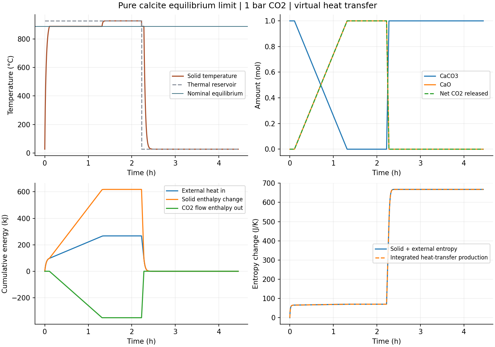

# 纯方解石等压热化学循环：限定数值核查完成

已把同源CaCO3/CaO/CO2焓、熵与反应平衡接入组成变化和开放CO2流焓，完成16000s受热分解—CaO显热—冷却再碳酸化—最终冷却。模型是1mol纯CaCO3、总压/CO2分压1bar、单元均温、瞬时相平衡的明确极限；传热系数1W/K、1200K/300K热库温程为声明虚拟工况，不能命名为真实砖坯动力学。

采用等压焓H，完整保留负生成焓和CO2流焓，没有把低温污泥固定质量的相对能量零点拼入反应。三相区由同源平衡温度1161.543908K与相组成焓定义，反应区的有限持续时间来自外部热量供应，**不是实测有限反应速率**。模型和来源范围见[事前定义](DESIGN.md)及[同源自由能阶段](../calcite-affinity-v1/REPORT.md)。

## 实际核查

最终使用tight误差尺度与1s最大步长，24454个记录状态完成能量/物料/熵核查。最大整体能量余额6.857e−7J，CO2物料差9.688e−13mol；两阶独立逐步焓残差≤6.890e−7J、反应进度残差≤1.417e−12mol，熵积分余额≤3.373e−9J/K。最小组合步熵约−1.192e−11J/K，在原1e−10允许量内；没有以名义熵产生非负替代实际积分检查。全部原预算通过。

与10s最大步长tight路径的8001观测对比，最大温差6.982e−8K、进度差9.010e−12mol、相区时刻差3.491e−8s。独立Cp/供热时间积分给出受热进入相平衡约381.862896s、完全分解约4735.132310s，与最终轨迹最大差2.313e−8s。Ca/C/O检查最大差0/9.688e−13/1.938e−12mol；相稳定方向判据差≤1.165e−10J/mol，均通过。

升温半程外部供热267.015203kJ，固体焓增618.202914kJ、CO2外流焓−351.187712kJ，共释放约1mol CO2；降温半程吸回约1mol CO2并向冷库放热267.015203kJ。净循环热量接近0不表示无需加热能源：热库温度不同，全循环熵增约667.538007J/K。这里没有预测燃料量、回收效率或实际产线能耗。

基础/更细失败全部保留，见[未通过记录](FAILED_CHECKS.md)：原数值Jacobian越域，基础熵误差、tight微小负步熵、过度收紧后的相区BDF步长失败及对应不完整比较均未删除。最终改为解析单反馈列和适当步长，不放宽预算、不扩大物性域、不修正或裁剪库存。七条完整/不完整轨迹已分块归档，逐字节往返相同，未运行软件测试或SHA。

## 复现与限制

求解入口`run_calcite_equilibrium_calorimeter.py`；最终参数`parameters.calcite_equilibrium_calorimeter_short_step.json`，tolerance=refined。`audit_calcite_equilibrium_calorimeter.py`做独立热流/相流积分和时间比较；`review_calcite_phase_observations.py`做组成/方向核查。反解与来源多项式仍共享，并非独立实测真值。结果见`short-step-review.json`和`phase-observations.json`。

图只读取已保存观测，使用独立`.tools/plot-venv`和`requirements-research-plots.txt`，不改变求解依赖。全部运行资源在本机，求解和绘图不联网。

MIA3真实矿相量、分解/碳酸化速率、供氧反应、孔连通、收缩和冷却实验对照仍缺；此循环没有填补它们。material_qualified=false、training_eligible=false。
