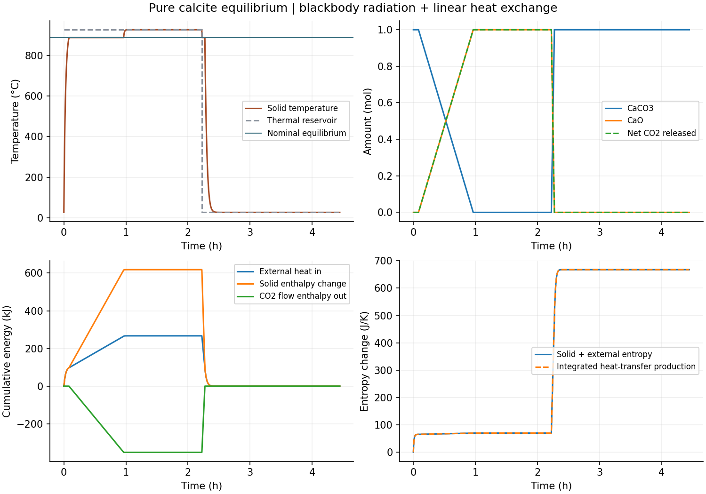

# 辐射换热与方解石平衡循环核查

此阶段完成恒定1bar CO2外库、1mol纯方解石的16000s热循环；增加显式理想黑体换热后，两档精度的来源热流、时间、元素、焓和熵预算均通过。它证明限定平衡方程的数值实现，不是实际砖发射率、有限化学速率或真实烧成时间的验证。

来源为[NIST 2022 CODATA常数表](https://physics.nist.gov/cuu/Constants/Table/allascii.txt)和[辐射边界定义](https://doc.comsol.com/6.3/doc/com.comsol.help.heat/heat_ug_theory.07.047.html)。σ由精确定义kB、h、c重算为5.6703744191844314e−8，与所用有限打印值差1.84431e−18 W/(m² K⁴)；5组正向、反向、平衡、近平衡热率的有理数参考差≤1.13687e−13W，温度导数差≤3.833e−11W/K。没有把有限表示差当材料不确定度。

紧容差记录24480个初态/接受步/观测/事件状态；焓账最大5.08942e−7J，CO2账2.10188e−12mol，积分熵账4.00651e−8J/K。二/四点独立积分的最坏局部焓3.88681e−6J、反应量8.32523e−12mol、累计熵6.67410e−9J/K；最小步总熵−2.58678e−11J/K，在既定1e−10数值容许内。没有放宽原预算。两档8001个共同时刻温度差4.08826e−7K、反应量5.40226e−11mol，事件差2.07975e−8s。

独立Cp/Q积分给加热反应开始296.001784746s、完成3465.484703358s，与ODE差≤6.106e−9s。此前仅线性换热为381.8628963s和4735.1323101s。辐射增强热流，改变热量输送时间；本理想平衡机制的平衡温度仍为1161.543908K。反应时长不能解释为已测动力学。

两条完整轨迹、32格Jacobian两条已完成轨迹均已分块gzip保存，逐字节解压还原一致，没有生成或比对SHA。化学稳定性和Ca/C/O核算通过；加热供热267015.202664J，冷却移热267015.202665J。完整循环净供热近零并不代表无需燃料：两个外库温度不同，过程总熵增约667.53800666J/K。

图已实际打开检查。全部根参数、原始日志、静态核算、循环审查、相观测及归档清单均已保存。ε=1是理想黑体定义，1e−3m²为虚拟面积；没有材料发射率。组合熵账中的Q/Twall是热库熵损失，不能当作辐射光子的熵流。气体外库保持CO2分压；有限气体库存反馈属于下一阶段。
