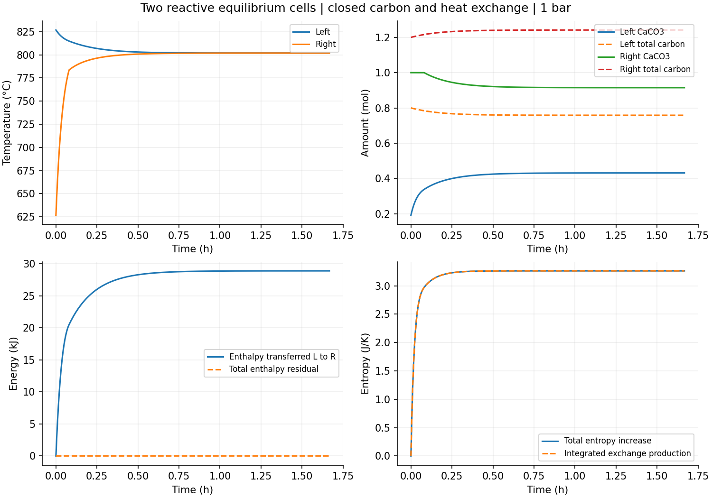

# 双单元反应—CO2迁移—热交换

已完成两个1bar等压可动边界单元、6000s封闭交换过程。每格1mol Ca、1mol N2；初始总碳0.8/1.2mol和温度1100/900K是明确虚拟初态，各初态先按同源纯相热化学平衡分配。CO2选择膜和热接触系数为声明条件值；没有真实砖输运或有限化学速率资格。

最终模型的静态20组T/C状态、4个C=Ca角点、3个正反/零面均通过。核对dH/dT、dH/dC以及dH−T dS=μC dC；同时平移CaCO3/CO2每mol碳的焓与熵零点后，状态/碳流/产熵不变，焓流仅按参考常数乘碳流改变。最大碳偏导/化学势恒等式差约1.065e−5/1.471e−5J/mol，在预定预算内。

两档过程的3001共同观测温差≤8.442e−9K、总碳差≤4.453e−12mol；当前最终紧容差轨迹的总碳及局部账≤4.885e−15mol，总焓及局部账≤1.560e−8J，积分熵账≤5.891e−10J/K。来源焓复算≤1.339e−8J，Ca/C/O/N库存≤4.441e−16mol，化学稳定性≤5.457e−12J/mol。

二/四点独立面代数与时间积分核查：最大局部碳差≤6.522e−13mol、局部焓差≤2.271e−6J、各格累计熵差≤1.849e−9J/K。最小单步总熵−2.274e−12J/K在原1e−10数值容許内，预算未放宽。右格确实从纯方解石分支进入两固相共存；左格一直共存，因此此路径覆盖反应与输运相互影响，而非只移动惰性气体。

约0.04159301865mol CO2从左向右迁移，按完整生成焓参考转移的总焓为28913.18194J，总熵增加约3.263845573J/K。最后两格约1075.08417/1075.08263K，仍有很小温差和通量，不宣称已达到精确静态平衡。用总Ca/C/N2/H独立构造聚合平衡，得到1075.083389114K；全轨迹总熵未超过该极限，最终熵差约7.5e−10J/K。两格固相比例并不必相同，纯固相共存的化学势不唯一决定各格库存。

四条完成轨迹（基础、原紧容差、分支比较修正、产物分配修正）和失败堆栈保留，gzip分块逐字节解压一致。最终审查为stable-products-review.json，当前紧容差轨迹为refined-stable-products.jsonl；原始SHA操作和软件测试均未执行。

## 实际发现与修正

聚合平衡求根首次失败，见review.stderr.txt：在C=Ca、低温平衡气体极小处，比较C−ceq≥Ca会先把ceq舍入掉，再错误选纯方解石分支并使CO2为零。改为等价的C−Ca≥ceq，直接保存ceq。随后检查同量CaO也不能用Ca−CaCO3的大数相减得到，改为(Ca−C)+ceq。298.15K角点得到形式连续相极限中的CO2/CaO各1.10283e−23mol，均被保留，反解/亲和力核查通过；如此微小的连续相量不能解释为可测的新相、实际成核或少数分子的确定性预测。

修正后实际重跑并完整审查，所有预定预算通过。旧轨迹、旧审查、输出和过程记录没有删改。来源还是同一USGS生成焓/Cp/熵；没有通过填入最小气体量、截断、改热化学或放宽预算掩盖错误。

下一阶段的边界：当前仍是等压可动容积，不是刚性砖孔。进入固定体积、压力反馈之前，必须明确固相体积假设、气体可用体积、完整内能与压力修正，分别做来源和热力学导数审查。USGS只给298.15K固相摩尔体积，真实热膨胀/压缩及砖孔连通不从该值自动获得。
