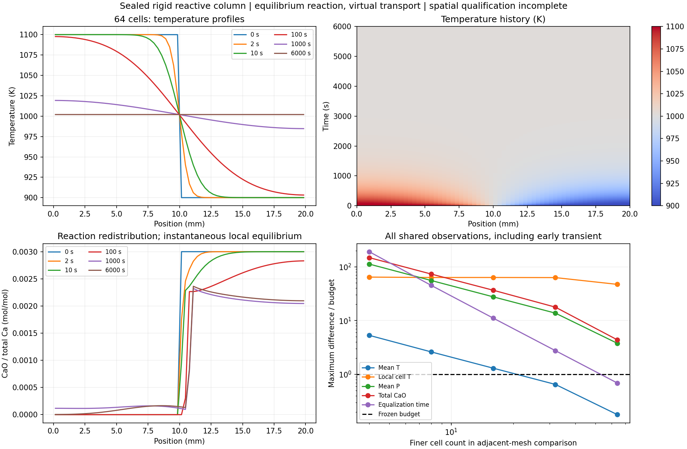

# 刚性反应一维柱：已推进到64格，空间资格仍未完成

现在可以计算声明条件下，2cm封闭绝热柱内的温度、CO2/N2压力、迁移总碳和气体库存、方解石/CaO平衡再分配。单元固定总体积，气孔体积随固相数量变化；总Ca不迁移。这是瞬时平衡反应与虚拟正定输运系数的条件模拟，未加入真实反应时间、砖骨架或孔结构测量。

所有网格使用同一初始物理问题：左半1100K、右半900K，总C=.01998mol、N2=3e−5mol、内能−22588.592370169143J。温度突变位于共同网格边界；不会因网格变化重新归一化初态。两格精细路径复现前一双刚性室记录：最大温差2.24e−8K、压差.00105Pa。

2/8/16/32/64格的双精度时间比較全部通过原目标；64格最大温差1.97e−5K、压差.45772Pa、总CaO差2.95e−13mol。2格两档、4格精细、8/16/32格两档的完整来源、逐格C/N/U、熵和两阶求积核查全部通过。64格两档的完整审查现也通过：精细轨迹两阶逐格U残差6.91e−7/8.11e−7J，C/N残差≤2.08e−12mol，逐格累计熵残差≤1.61e−9J/K；无超预算负熵步。全部11条已归档轨迹的完整预算均通过，空间资格仍单独未过。

空间比较保留从最早共同观测到6000s的全时段，预算在首次计算前固定：均温.05K、局部体积平均温差.2K、均压100Pa、总CaO差1e−8mol、温差降到1K的时刻差2s。

| 相邻网格 | 均温最大差K | 局部平均最大温差K | 均压最大差Pa | 总CaO差mol | 均温时刻差s |
|---|---:|---:|---:|---:|---:|
| 2→4 | .26580 | 12.84582 | 11231.44 | 1.47929e−6 | 381.42730 |
| 4→8 | .13077 | 12.63285 | 5555.36 | 7.31939e−7 | 90.11901 |
| 8→16 | .06510 | 12.63911 | 2758.45 | 3.65964e−7 | 22.17596 |
| 16→32 | .03255 | 12.57991 | 1376.00 | 1.77669e−7 | 5.52332 |
| 32→64 | .00891 | 9.41525 | 377.33 | 4.37487e−8 | 1.37833 |

最后一组仅均温和时刻差通过，局部温度、均压和CaO仍失败。大局部误差来自最早观测附近的初始突变层；不删除这些时刻、不放宽门槛。进一步加密已登记并启动。空间误差与守恒误差是不同问题，守恒通过不等于空间分辨率足够。

11条完成的原Jacobian轨迹和两条解析Jacobian轨迹已分片归档，逐字节解压往返一致；清单`archives.json`，它只说明存储完整，不代替物理核查。初次结果序列化错误与完整的重跑结果分别保留，见[FAILED_CHECKS](FAILED_CHECKS.md)。

解析导数的4/16格全过程核查见[下一项记录](../calcite-rigid-tangent-v1/REPORT.md)，线性化算子和共存静止族见[解析模态](../calcite-rigid-modes-v1/REPORT.md)。这些改进没有改变材料资格：`material_qualified=false`、`training_eligible=false`。薄膜起始温度的外部偏差、同材数据和有限速率来源问题均未因此消失。
