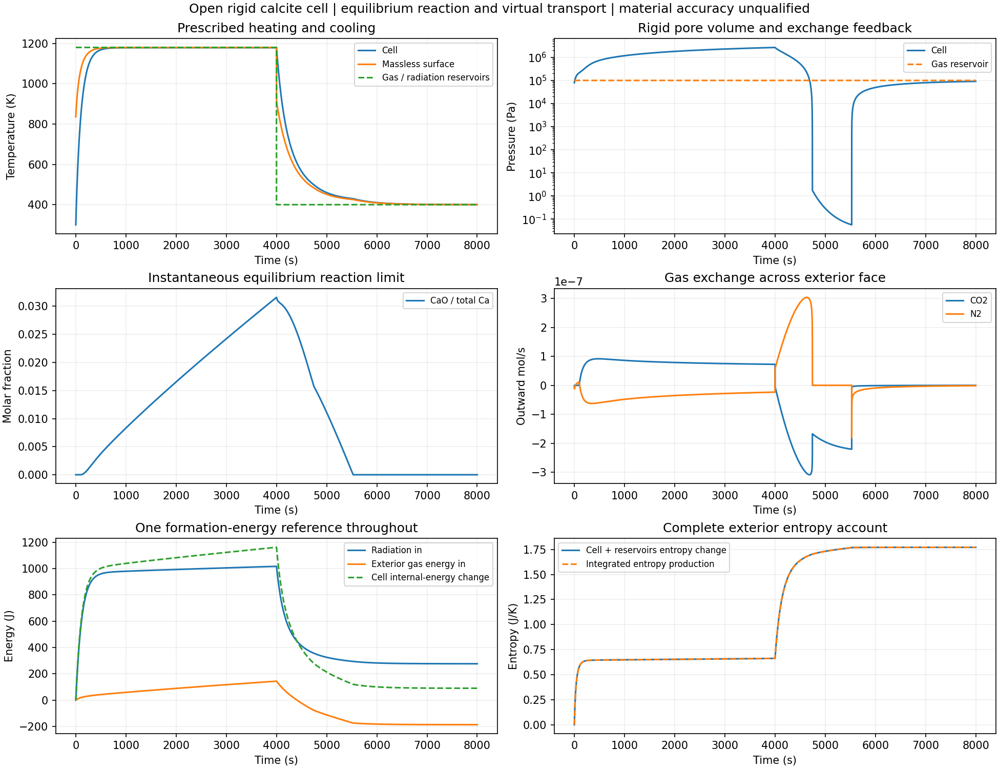

# 开放刚性反应单元的条件循环

一个固定Ca库存.01mol、总体积1cm³的虚拟单元，已完成300K初态→1180K热气/辐射库4000s→400K富CO2气库冷却4000s。气库均为1bar，热段CO2摩尔分数.0004、冷段.1。模型同时计算温度、压力、CO2/N2进出、方解石与CaO相分配、内外侧携焓、辐射及完整熵账。它使用瞬时反应平衡，不提供真实反应时间常数。



所有接受状态中的最高温度1178.943K、最高压力2.67705MPa、最高CaO/Ca比例3.1590%，均在4000s。冷却再碳酸化接近完成时，模型最低压力.0563976Pa，CO2约7.1670e−19mol；最终CaO为零。该低压和高压跨度进一步表明，虚拟有限力Onsager系数、理想混合气体和恒定固相体积不能当成真实砖孔输运的已验证本构。这里没有给出跨这些压力条件的材料误差界。

## 失败和数值表示

原物理库存基础精度完成且全审查通过，紧精度在5527.834s附近失败。诊断重跑捕获BDF试算N2=−3.80130e−9mol，直接触发对数定义域错误。改用z=ln(N2/Nref)后，基础精度完成且全审查通过，但紧精度仍因所需步长小于浮点时间间距停止。直接积分δ=C−Ca并保留它反解相库存后，两档仍在同一区域停止；这些结果都保留为失败前缀，没有裁剪库存或补写完成记录。

碳差值表示先经过33个状态与50位Decimal几何/标量平衡重建比较，固定相同的双精度源势。气量最大相对差1.014e−13、U差1.819e−12J、P差5.821e−10Pa、反解温差2.39e−12K，原预算通过。这不是50位材料物性准确性声明。单独换库存坐标不足以解决最终步长失败。

在一个边界段内，所有库参数恒定，ODE为自治系统。每个接受步记录后把局部求解器时间移到零，保留BDF差分表、阶数、步长、Jacobian及分解；下一段仍按原程序重新启动。时间平移不改变自治方程或BDF系数。所有稠密多项式保留局部起止/节点，积分使用实际局部宽度；物理时钟用math.fsum累加每步宽度。两段宽度分别求和均为4000s。

当前安装SciPy 1.18.1。已读本地BDF实现，并核对[官方源码](https://github.com/scipy/scipy/blob/v1.18.1/scipy/integrate/_ivp/bdf.py)与[接口文档](https://docs.scipy.org/doc/scipy/reference/generated/scipy.integrate.BDF.html)：其最小步长取当前时间的相邻浮点间距倍数，稠密多项式以差分和相对时间构造。这次修改依赖所读实现；源码升级需要重新核对。它只用于分段自治程序，不能直接推广到随时间连续变化的边界。

最终两档分别9605/10283步，76.57/79.99s。紧精度最小接受步4.6243e−12s，小于原全局时钟处9.0949e−12s的最小步门槛，共11步低于旧门槛。原失败和成功轨迹均归档；没有改变热化学、传输系数或验收预算。

## 已核范围

最终两档的每个记录状态及全部接受区间的2/4阶Gauss积分均核对。源H/S/P/V/相平衡、Ca/C/N元素、内侧与外侧C/N/U账、无储量表面、辐射、逐步和全程总熵均达到原门槛；最小物种正、固相非负、所有独立面熵产生不低于约定浮点容差。独立源展开与交换面算术不等于独立热化学数据库；稠密节点共享平衡反解和表面求解器，这一依赖明确保留。

紧精度最大内/外物种账残差2.618e−13mol、U账5.111e−11J、总熵账1.405e−9J/K；逐区间独立积分最大物种差5.086e−15mol、U差6.669e−9J；总熵积分差1.162e−10J/K。无储量表面能量率最大8.958e−14W。

4001个共同观测的两档最大温差2.795e−7K、压差.003707Pa、CaO差4.491e−13mol。与原物理库存基础精度相比，最大温差2.758e−7K、压差.019515Pa，均在事先.001K/1Pa/1e−8mol的时间目标内。未把这些采样差视为连续误差上界。

九条成功/失败原记录总计约145MB压缩数据，清单`archives.json`逐项保留完成状态、分片顺序和逐字节往返结果，不生成校验和。可按清单解压串接重建后运行下列离线入口：

```sh
.venv/bin/python examples/sandbox/run_calcite_rigid_open_cell.py --parameters parameters.calcite_rigid_open_cell.json --tolerance refined --coordinate-parameters parameters.calcite_rigid_open_local_time.json --output /tmp/calcite-open-repeat.jsonl
.venv/bin/python examples/sandbox/audit_calcite_rigid_open_cell.py --parameters parameters.calcite_rigid_open_cell_audit.json --trajectory /tmp/calcite-open-repeat.jsonl --output /tmp/calcite-open-repeat-audit.json
```

本阶段授予的只是这个条件单元的数值实现资格。完整空间砖坯、有限反应速率、真实孔径/渗透性、烧结收缩、力学与同材料全周期验证仍未完成；`material_qualified=false`、`training_eligible=false`保持不变。
