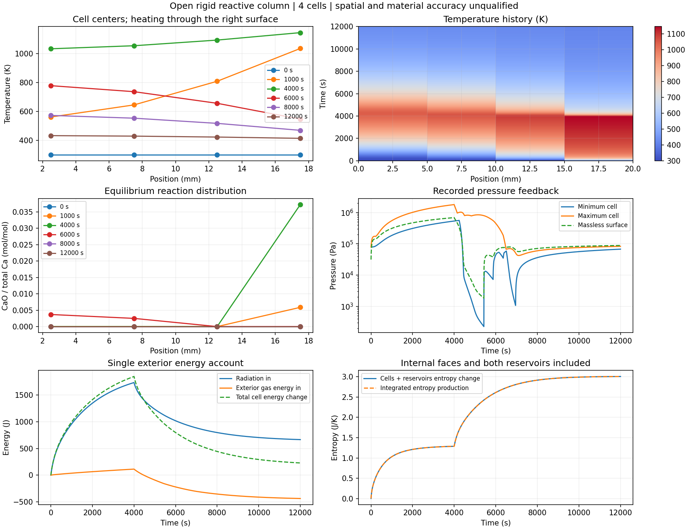

# 开放反应列：空间过程已接通，精度资格逐项保留

2026-09-25 UTC。已实现固定几何下的一维传热、CO2/N2交换、局部平衡分解/再碳酸化，以及右端炉气和辐射输入。完整12000s程序包括4000s加热和8000s富CO2冷却。四格的完整来源、逐格物种/能量、外部账本和熵积分均通过预定预算；八格时间比较通过，但4→8空间误差仍明显超标。**这是有来源热化学支撑的条件模型，尚未达到空间精度目标，也没有实际砖材料资格。**

## 定义和来源

几何为声明的2cm长、1cm²截面刚性列，左端密闭绝热，右端无储量表面。全部网格共享总体积2cm³、Ca库存.02mol、初温300K、气相额外碳2e−8mol和N2库存4e−5mol。内部距离dx，边界半格距离dx/2；没有随格数改变整块初始库存。

CaCO3/CaO/CO2/N2热化学沿用[USGS来源及刚性定义](../calcite-rigid-equilibrium-v1/REPORT.md)，包括完整生成能、气体混合熵和不可压固相的压力化学势。内部及表面气流为已声明的虚拟正对称输运关系，热导率.1W/(m K)与气体迁移系数没有实材校准；其有限驱动力使用是显式本构延伸。[无储量表面](../calcite-rigid-surface-v1/REPORT.md)同时平衡两物种和能量，辐射使用NIST常数及声明黑体围壁。局部瞬时平衡不提供有限化学反应速率。

根参数为`parameters.calcite_rigid_open_column_extended.json`。积分变量逐格为C−Ca、ln(N2/Nref)、U；10个外部账本记录内/外气流、辐射、库熵与总熵产生。内部面以反号进入相邻单元，完整审查再独立积分每个内部面，逐格核对C/N/U和熵。局部时钟与坐标变换的来由见[开放单元](../calcite-rigid-open-cell-v1/REPORT.md)，这里只在恒定边界段使用。实现细节见[设计记录](DESIGN.md)。

## 开发与独立核查

静态四组状态包括单格冷态、四格冷态、热梯度和冷却梯度。完整物理坐标解析导数、守恒导数、熵率恒等式和被动账本列分别核对。原冷态较粗差分步的尺度化误差1.10862e−5超过1e−5，保留`static-review.json`；三档差分步统一减半、误差尺度及预算不变后，`static-fine-review.json`全部通过。没有用跨分支差分证明分支导数。

先将单格专用实现改成同一几何、同一半格边界距离，做8000s完整对照。新空间装配与原单格实现最大温差1.02705e−9K、压力差7.7513e−5Pa、CaO差1.4233e−14mol、表面温差5.3245e−10K；两条全程审查均通过。原8000s并未降至事先的500K平均温度事件，记录为缺失，没有填造时间。多格运行前显式延长冷却至12000s，事件温度和误差目标不变，保留原8000s记录。

| 完整12000s轨迹 | 接受步数 | 全程逐格/来源/熵审查 | 逐格局部U最大残差，2/4点积分 |
|---|---:|---|---:|
| 1格，较高精度 | 12185 | 通过 | 5.37027e−9 / 5.37027e−9 J |
| 4格，基础精度 | 13268 | 通过 | 3.42342e−7 / 3.42342e−7 J |
| 4格，较高精度，解析导数 | 13901 | 通过 | 1.90529e−8 / 1.44649e−8 J |
| 4格，较高精度，数值导数 | 13881 | 通过 | 1.92449e−8 / 1.45791e−8 J |

审查遍历每个记录状态及每个接受步的2/4点Gauss节点。四格较高精度累计逐格能量最大残差1.17087e−7/1.15283e−7J，逐格累计熵8.42472e−11/9.34048e−11J/K；逐格局部物种最大4.772e−14mol。采用原1e−5J、1e−10mol、1e−7J/K预算，未因新几何放宽。源物性和面流另行展开，但平衡flash及表面求根仍共用；这是明确的核查独立性边界。

6001共同采样时刻上，四格两档最大格温差1.65742e−6K、格压差.00257077Pa；解析与数值导数两路最大格温差1.09913e−9K、格压差.000118566Pa，均满足原时间预算。八格两档完整轨迹也已完成，最大格温差2.54806e−6K、格压差.0413974Pa、CaO差3.32279e−13mol，时间预算通过；两格及八格两档完整局部审查也已通过：八格较高精度检查175256个格状态，逐格局部U最大5.07968e−8J，累计逐格U最大3.93026e−7J，累计逐格熵最大4.90377e−10J/K；全部原预算通过。

## 空间误差没有通过

保留最早共同采样点和所有相变时段，不删除不利时刻。`parameters.calcite_rigid_open_column_eight_comparison.json`在后续网格运行前固定比较定义：细网格按体积等分平均到粗格，分别核对均温、格温、均压、总CaO、同一物理表面温度以及两个平均温度事件。事件时间来自2s观测间的线性定位，不是精确连续根。

| 相邻网格 | 最大均温差 K | 最大格温差 K | 900K加热时刻差 s | 500K冷却时刻差 s |
|---|---:|---:|---:|---:|
| 1→2 | 99.4189 | 99.4189 | 681.789 | 758.252 |
| 2→4 | 45.7971 | 92.2337 | 153.090 | 186.088 |
| 4→8 | 20.6667 | 83.8789 | 38.1408 | 46.1854 |
| 冻结预算 | .05 | .2 | 2 | 2 |

4→8均压差105045Pa、总CaO差5.90937e−5mol、表面温差90.713K也超过100Pa、1e−8mol、.2K预算。事件差缩小并不意味着全程空间精度通过。16格双精度运行按原协议继续，不能把四格图作为已收敛预测。

四格图的6001采样点显示明显内部温度梯度：最大温差约578.81K，最高局部CaO占比约.03720，最终四格温度约431.97/428.54/422.07/413.26K并恢复零CaO。压力范围约226Pa–1.796MPa。它们是尚未空间收敛的条件模拟量，非实测量或连续极值；虚拟输运跨此范围的实际适用性未确定。

## 复现、失败和下一步

数据在`data/sandbox/research/calcite-rigid-open-column-v1/`。静态原失败、较细差分、几何参考、两档时间/路径对照、完整审查和图用观测均保存。首批6条完整轨迹见`initial-archives.json`，压缩共248054750字节，逐字节解压回读一致；没有校验和操作。原记录可按清单的分片顺序解压连接。两格/八格三条完整记录见`eight-archives.json`，压缩268405659字节，也均逐字节回读一致。

启动两格/八格完整审查时曾误传运行参数文件，发现后在结果生成前中断3条自建进程，保留原stdout/stderr，并以原`parameters.calcite_rigid_open_cell_audit.json`从头重算；见`audit-invocation-correction.json`。不能将这些中断过程称作物理核查完成或物理失败。

下一步完成16格完整审查及后续空间加密，再判断原空间预算。真实材料仍需同配方库存、压力/温湿依赖输运、有限反应速率和实测留出；本阶段不连接未经定义的低温相对能量与高温完整生成能，不升级M1或全周期资格。未新增或运行软件测试、未调用子代理，`material_qualified=false`、`training_eligible=false`。

## 16格完整核查增量

两档17449/19942步均完成，来源/逐格C/N/U/熵及2/4点积分全部通过。基础档累计逐格U最大4.04783e−6J，精细档7.40571e−7J，均在原1e−5J内。两档最大格温差8.30766e−6K、格压差.0220193Pa、总CaO差1.10085e−13mol，时间精度通过。

8→16空间仍失败：均温8.24698K、格温67.6313K、均压44509.3Pa、总CaO3.79991e−5mol、表面温差161.207K；加热/冷却事件差10.7688/11.2707s。表面误差并未随此步网格加密单调缩小，不能以事件误差下降替代完整空间目标。32格两档继续。两条16格完整压缩记录的字节回读均一致，共545978908字节；清单sixteen-archives.json。
