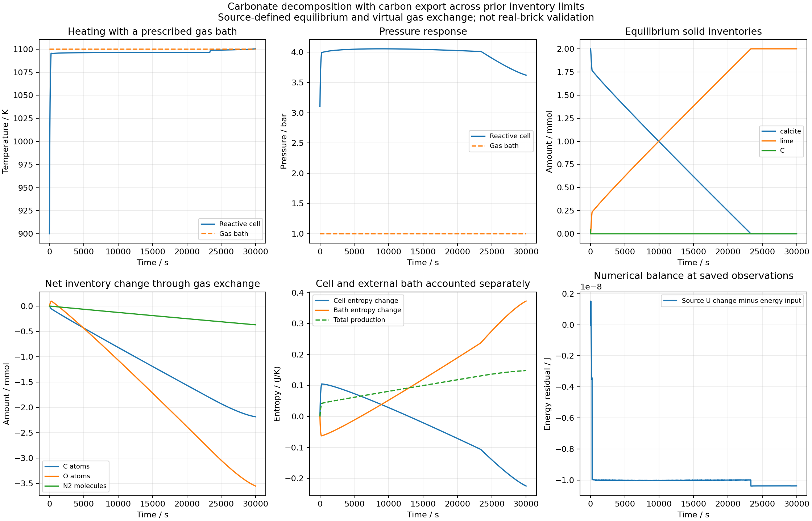

# 共同反应单元的碳外排与相耗尽

2026-09-25 UTC。以100cm³虚拟刚性腔、Ca/C/O/N2初始库存0.002/0.0022/0.0062/0.004mol及900K为起点，与1100K、1bar、CO/CO2/O2/N2摩尔分数1e-10/0.0004/0.21/0.7895999999的规定气体库交换。采用同源USGS纯CaCO3/CaO/石墨和理想CO/CO2/O2/N2、常固相体积、局部瞬时平衡。换热和输运系数为虚拟参数。

## 先核对，再积分

根参数 `parameters.carbon_calcium_domain_crossing_cell.json` 及 `_tangent.json` 冻结原来源、导数、元素/U/S及时间预算。36组静态和4组匹配气体库、6个温度的初始库存热学导数均通过；只使用获准的热学库存响应，不使用尚未获准的气体化学势库存Jacobian。

两档20000s轨迹完整完成：4811/5202个接受步，18.816/20.090s实际耗时。完整来源重建、逐步/累计元素和能量、体/气体库熵、2/4阶求积及4000个时刻的时间比较全部通过原预算。最大时间差为T 5.001175e-8K、P 4.997296e-5Pa、相量3.248962e-13mol。

20000s末仍有0.000246949208mol方解石，故另存30000s延长算例；原20000s证据保留，参数和预算均不改变。延长两档分别6930/7384步，完整复核12931/13385个记录状态、41580/44304个Gauss节点及13860/14768次端点。全部通过。最大全局能量残差9.637131e-8/1.045112e-8J，熵残差6.180825e-11/5.395635e-12J/K；6000个观测时刻的时间比较也通过。

## 实际记录的变化

下表是每5s保存观测的括区，未冒充独立高精度事件时刻。

| 时间括区/s | 变化 |
| --- | --- |
| 20–25 | 方解石单相转为方解石/石灰共存，石墨仍在 |
| 25–30 | 石墨相耗尽 |
| 230–235 | O−Ca−2C穿过0 |
| 2025–2030 | C库存降至Ca以下 |
| 3010–3015 | O库存降至3Ca以下 |
| 23340–23345 | 方解石相耗尽，钙全部处于石灰相 |

30000s末T=1100.383758K，P=362009.404Pa；总碳1.6201041721e-5mol，即初始碳的0.736411%，其余约99.263589%已外排。方解石和石墨均为0，石灰0.002mol；仍有气相碳，不能称总碳完全清除。气体仍在交换，不能称已达到外界稳态。

净输入能量1137.178946J包含气体携能；体熵变化−0.2244183343J/K、气体库熵变化+0.3724903514J/K、总熵产生+0.1480720171J/K。外界是维持组成的非平衡库，略高于气体库的末温不构成无能量来源的升温；维护气体库的设备不在模型边界内。

## 复现和资格

运行 `examples/sandbox/run_carbon_calcium_open_cell.py`，分别使用原/延长根参数及 `--tolerance base`、`refined`；审查入口 `audit_carbon_calcium_open_cell.py` 配合对应 `_audit.json`。来源、静态、导数和完整积分结果位于 `data/sandbox/research/carbon-calcium-domain-crossing-v1/`。

四条原始记录均按根归档参数分块压缩，并逐字节还原核对一致；20k两档压缩7843180/8290897B，30k两档11249334/11786840B。不使用SHA；未新增/执行软件测试。图只显示保存观测，PDF同时保留。

这证明所声明条件模型可连续跨过原受限库存域，并正确记账已录相耗尽过程；不提供真实污泥焦反应动力学、砖孔输运系数、烧结收缩、干湿至高温的同材料热学连接或完整烧砖验证。`material_qualified=false`、`training_eligible=false`。
