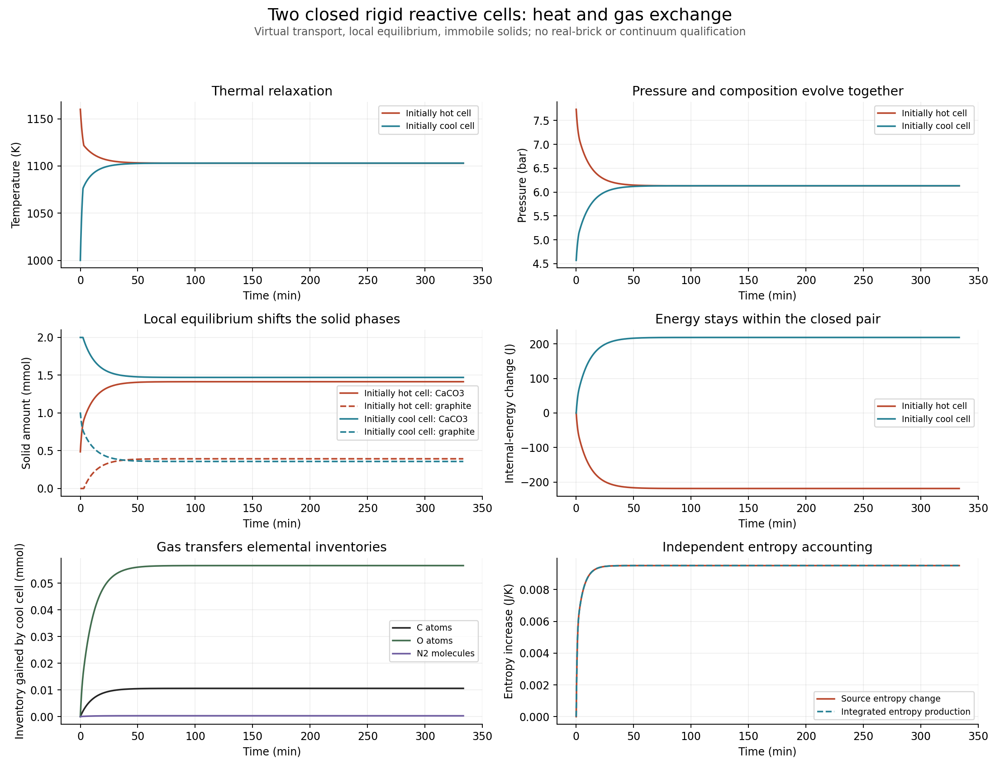

# 两个定容共同反应单元的热与气体交换

2026-09-25 12:04 UTC：交换静态资格及两档20000s完整动态数值资格通过。仅限所声明虚拟两单元系统。

## 物理定义与来源

沿用已独立核查的USGS热化学、理想CO/CO2/O2/N2气体与纯CaCO3/CaO/石墨局部瞬时平衡。两个单元各自定容，固体不跨面；气体携带C/O/N与完整能量。钙原子固定在各格。单元元素域仍为C>Ca、O>3Ca、N2>0，温度298.15–1200K；这不是任意污泥配方求解器。

[Onsager1931原文](https://journals.aps.org/pr/pdf/10.1103/PhysRev.37.405)印刷408页(2.1)–(2.3)提供一般通量—力表述。本文明确另选虚拟对角迁移率和对称面焓，不能将这些设定称为原文测得的砖体参数或远离平衡的真实输运定律。

设正向为左→右，`hbar_i=(h_i,L+h_i,R)/2`，`F_i=mu_i,L/T_L-mu_i,R/T_R+hbar_i*(1/T_R-1/T_L)`，`J_i=L_i F_i`。能量流为`E=G*(T_L-T_R)+sum(hbar_i*J_i)`。局部平衡满足`dS=(dU-sum(lambda_e*dN_e))/T`；气体化学平衡给出`lambda_O=mu_O2/2`、`lambda_C=mu_CO-lambda_O`、`lambda_N2=mu_N2`，因此将各分子流映射成元素流后，左右熵率严格合成为

`G*(T_L-T_R)^2/(T_L*T_R)+sum(L_i*F_i^2)>=0`。

这是所声明模型的热力学一致性推导，不是实材误差界。`G=.005 W/K`与四个`L_i=1e-9 mol² K/(J s)`全都标为虚拟设定，保存在根参数文件。熵非负不能单独证明传质速率准确。

## 静态核查

三个元素库存×六个温度，共18个状态，覆盖六种钙/碳相组合。独立60位同时气相、体积、相分数方程与来源积分重构，不用运行时嵌套压力根作为参考值。固定T,V的C/O/N中心差分验证`dU-T*dS=lambda_e*dN_e`，共108组差分。原1e-5相对扰动在5处超过1e-5J/mol预算，最大2.92670755e-5J/mol；3e-6扰动最大2.63403677e-6。原`face-review.json`总结果false保留。

另存1e-6/3e-7扰动的`face-fine-review.json`，预算完全不变，最大误差2.92670752e-7J/mol，全部同相检查通过。18组来源面比较最大物种1.15e-20mol/s、元素2.64e-20mol/s、能量8.77e-16W、熵6.53e-18W/K；正反向流精确反号、总熵产生不变，同一状态流为零。以上两档细差分均通过。

## 动态预登记

两个100cm³虚拟单元，各Ca=.002mol、C=.0045mol、O=.008mol、N2=.004mol，初温1160/1000K，封闭交换20000s，无外热源。只积分C/O/N、相对初始内能变化与独立总熵产生；每次从U,V和元素库存反求平衡态。不裁剪相量或温度，不自动重试失败。

根`parameters.carbon_calcium_exchange_run.json`冻结：两档时间容差相差10倍；局部/累计元素积分1e-10mol、能量1e-5J、熵1e-8J/K，源U1e-7J、源S1e-10J/K，体积1e-14m³，气相压力1e-5Pa。全过程所有接受状态与2/4阶稠密求积节点都须检查。温度.001K、压力.1Pa、各相1e-10mol的时间比较与积分门槛相互独立。最终还需核对相量非负、真实累计熵变化及每步负熵容差。当前不能预判通过。

本阶段没有空间连续体或真实砖资格。没有孔结构、烧结收缩、有限反应速率，也没有把低温水分能量基准连接至该高温形成焓。

## 已完成动态结果

基础/精细1125/1192接受步、109.19/120.48s本机耗时，两档全来源、逐格C/O/N/U/S及2/4求积审查全部通过。来源状态核查数分别4252+13500稠密点、4386+14304稠密点；最大元素误差8.68e-18mol，源U1.37e-12J、源S1.12e-15J/K，压力约3.78e-7Pa，体积5.34e-17m³。所有气相为正、固相非负、Cv为正、瞬时熵产生非负。

基础最大局部/累计能量积分残差6.325e-7/8.797e-7J，精细7.112e-8/2.712e-7J，均低于1e-5J。最大逐格累计熵残差8.645e-10/2.776e-10J/K；总体系源U守恒误差≤2.729e-10J；积分熵与源总熵差≤5.296e-10J/K。微小负熵步约-9.33e-15J/K保留，处于事先1e-10J/K舍入容差内，未把它截为零。

1000个共同观测，两档温差2.1581e-7K、压差.00031633Pa、相量差2.2446e-12mol，均通过。轨迹无损归档2738268/2886028字节，解压逐字节一致，原始每步记录可恢复。

精细终态两格1102.978729832/1102.978727367K、613152.984729/613212.574688Pa，分别共存CaCO3/CaO与石墨。由源状态得到的总熵增与独立累计熵产生约.0095141166J/K一致。仍有约59.59Pa压差及缓慢物质交换，不声称已经完全平衡。固相分配不因温度接近而强制相同。图`exchange.png`已检查可读性，仅展示这一条件算例。

