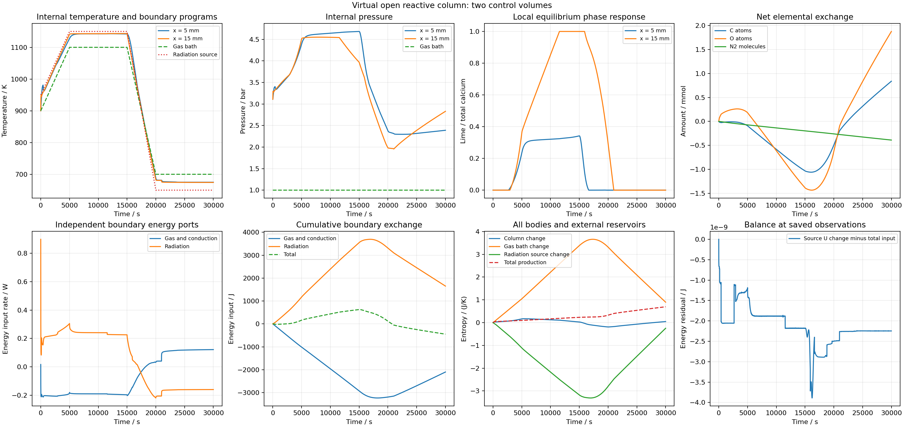

# 开放共同反应列：单格等价资格完成

2026-09-25 UTC。已把限定Ca/C/O正库存平衡、CO/CO2/O2/N2内部交换、规定外部气氛及独立黑体辐射连接为一维控制体列。总库存、100cm³体积及外界程序与已核对的单腔相同；单元刚性、固相不迁移，左端封闭，仅最右单元交换气体和热量。

几何2cm×50cm²、内部传热/气体迁移系数、外部传递系数及1cm²理想辐射端口都是明确虚拟定义。内部面系数按截面积/格心距离缩放。外部关系直接使用末控制体的温度和化学势，未隐藏表面储量、半格热阻或表面求根；这是待空间核查的离散近似，不是实际砖孔/表面模型。根参数与[预先计划](PLAN.md)保留这些区别。

## 静态装配资格

从已验证单腔的0/1000/5000/15000/20000/30000s六个观测，构造1/2/4格18组非均匀状态。独立来源重建、局部C/O/N/U/S率、外界能量/熵、总熵关系均达到原预算。最大局部库存率差8.470330e-22mol/s、能量率差6.938894e-16W、熵率差2.114194e-18W/K。三个网格初始总体积、库存和能量与原单元相同；六组单格变化率的所有字段与原单元相同。

首次结果写出遇NumPy布尔序列化错误，不完整JSON和stderr保留；v2把明确的熵残差转换为普通浮点值后完成，没有调整任何计算或预算。

## 单格完整程序资格

两档30000s程序完成8083/9216步，实际20.294/22.807s。使用有明确稀疏结构的数值Jacobian，不使用尚未获准的正库存气体化学势解析库存Jacobian。

独立审查分别覆盖14087/15220个记录状态、48498/55296个Gauss节点和16166/18432次端点。逐步/累计每格C/O/N/U/S、外界元素和能量、气体/辐射的独立能量/熵、总熵、2/4求积及时间预算全部通过。最大全局能量残差1.522380e-8/2.821480e-9J、熵残差3.864786e-11/5.716427e-12J/K；四阶累计体U残差6.853219e-8/1.470886e-8J。最小一步总熵6.736389e-12/2.509104e-14J/K。

6000共同观测的时间比较最大T6.196183e-8K、P1.900826e-5Pa、相量1.263640e-13mol；精细档与已验证原单腔比较最大T1.252488e-9K、P3.867026e-7Pa、相量1.432014e-15mol，都保持原门槛。没有把数值路径改变后的微小差异称为严格逐步同值。

所有已重建的记录/Gauss状态温度约674.3426–1142.9653K，处于七相来源范围交集298.15–1200K内；仿射气体温程也在范围内。范围直接取每相来源元数据，结果另存 `one-source-domain-review.json`；后续审查入口内置同一来源范围核算，不外推方解石热容。

两档原始记录64047310/70162768B，无损压缩14926999/16452767B，逐字节还原一致。完整审查为 `data/sandbox/research/carbon-calcium-open-column-v1/one-full-audit.json`，可用 `run_carbon_calcium_open_column.py` 和 `audit_carbon_calcium_open_column.py` 配合根参数离线复现。未新增/执行软件测试或SHA。

两格两档已启动；1→2格空间预算预先冻结，尚未获空间资格。上述不改变实际材料、有限反应速率、烧结收缩或同材料全周期的缺项，`material_qualified=false`、`training_eligible=false`。

## 两格：完整收支/时间通过，空间失败保留

两档30000s完成9569/11353步，实际44.989/50.997s。完整来源、逐格/外界元素/U/S、辐射与气体分账、2/4求积和时间核查全部通过；31146/34714记录格状态、114828/136236个Gauss格状态及38276/45412次端点都纳入。全局能量最大残差2.443267e-8/3.891159e-9J，熵3.234762e-11/4.924880e-12J/K；全节点温度674.2603–1143.4045K位于来源范围内。6000时刻两档最大T差7.156746e-8K、P差2.575072e-5Pa、相量差1.168929e-13mol，原预算通过。

1→2空间6001观测的最大平均/父格温差14.341322K、平均压差31239.213Pa、总相量差0.0003258725mol，四项仍超原目标。所录外格可全部分解而内格只部分分解，说明空间分布是重要待核量；不能用粗格反应图称真实反应前沿已经准确。两条完整记录的分块无损还原一致。

四格阶段已冻结原预算并启动；同时下一独立物理增量将明确半格内传递和外部气膜/辐射之间的无储量界面。此增量会另存来源、公式和资格，不回写本直接末格接触基准。

## 四格：来源/时间资格通过，空间仍未收敛

两档完成11143/13519步，实际102.428/118.551s。完整来源、逐格与外界收支、两种热源账目、熵、2/4求积和时间比较均在原预算内。审查覆盖68588/78092记录格状态、267432/324456个Gauss格状态及89144/108152次端点。全局能量最大残差2.038385e-8/3.245560e-9J，熵1.566133e-11/2.282292e-12J/K。6000时间观测最大T差1.028224e-7K、P差5.380606e-5Pa、相量差1.325319e-13mol。两档无损归档共约130MB，逐字节还原一致。

2→4空间6001观测仍四项失败：平均温差11.441763K、父格温差17.563040K、平均压差23329.544Pa、总物种量差0.0002831391mol。平均温差下降不能替代所有空间指标通过；仍保持未收敛结论。下一八格按原参数和预算冻结。
