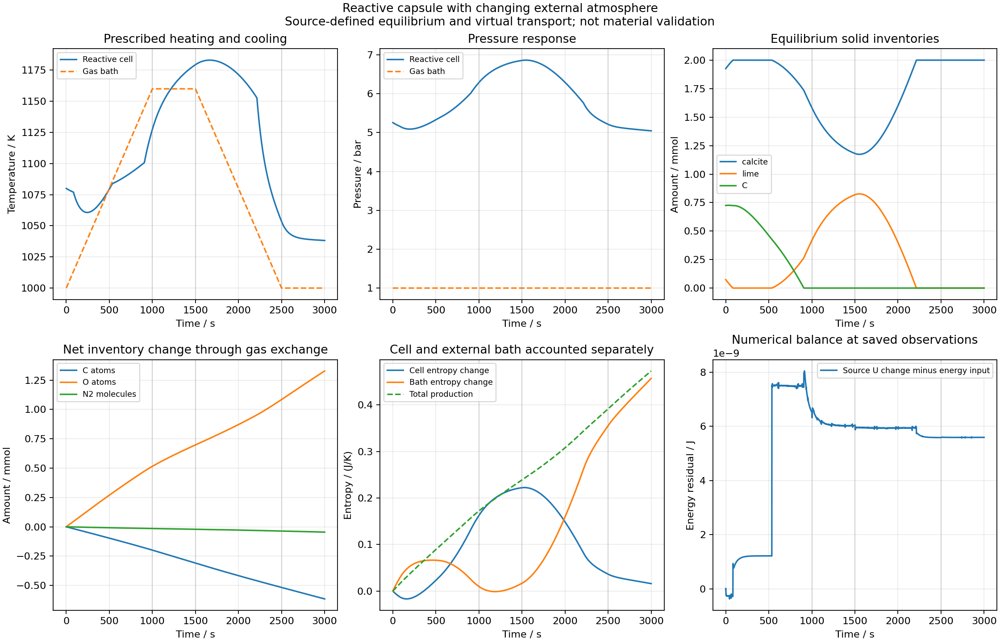

# 外部温度与气氛连续变化的共同反应单元

在已完成资格的恒定气体库单元上，独立加入外界温度、压力、组成的连续分段仿射程序。沿用现有BoundaryProgram；只插值T/P/y，之后按同源理想气体重新计算h/mu，未插值化学势。每个节点结束后重启BDF；这里使用实际绝对时间，稠密记录也使用同一实际时间。外界没有辐射换热项，程序接口中的辐射温度字段明确未用于本算例。

体积、初始Ca/C/O/N2、相平衡、虚拟换热及气体迁移率沿用恒定算例。外界T在0→1000s由1000升至1160K，保持至1500s，2500s回到1000K并保持至3000s；压力1bar。CO始终1e-10，CO2/O2由.4/.2变为.05/.1再返回，N2补足之数事先明确写在根参数，未运行时归一化。全部是虚拟工况，未标作实测窑况。

## 边界来源与完整积分

12个规定时刻用独立60位仿射算术和来源Cp积分核查，最大T差7.276e-14K、组成差5.552e-17、h差3.645e-11J/mol、mu差1.133e-10J/mol，均低于事先预算。高精度用于重算，不代表材料参数有60位准确性。

两档3346/3391接受步、48.35/47.62s本机时间，均完成3000s。6350/6395保存状态及20076/20346稠密Gauss状态完成来源、元素、气体和固相正性、逐段/累计能量与两侧熵、2/4求积核查，全部通过原预算。重复核查的端点另列counts，不冒充新的时间点。所有外界记录T/P/组成与独立插值相同，最大mu差3.493e-10J/mol；稠密通量使用对应实际时刻的独立来源外界。

基础/精细最大能量账差2.547e-8/9.550e-9J，总熵账差2.315e-11/8.891e-12J/K。四阶累计单元U差2.466e-8/9.539e-9J，最低系统总熵步增量5.037e-12/4.752e-13J/K；所有原预算不变。3000共同观测时间差T1.443e-8K、P.00001674Pa、相量1.217e-13mol，均通过。

审计器现在显式选择恒定或程序气体库。恒定算例重新完成全部来源和2/4积分；旧结果字段及时间比较逐项精确相同，完整输出保存在原恒定目录full-audit-boundary-routing.json，不用“代码看起来等价”代替确认。

## 可观察结果与边界

在每秒保存观测中出现四处相状态变化：83–84s方解石/石灰共存转仅方解石，535–536s重新共存，906–907s石墨相耗尽，2213–2214s转回仅方解石。这些是观测括区，不是独立高精度相事件时刻。

记录T范围1038.195–1183.032K，内部P范围约5.045–6.864bar。内部最高T高于1160K外界，不单凭温差判断违反热力学；能量包含同源生成焓和气体交换，全程真实来源U收支已核查。末态仍有CO和CO2，石墨相量为零不表示全部碳从系统消失。净入能量约−378.999J包括气体携能，不能等同外界散热量或整窑能耗。累计单元熵变化+.0160056J/K，外界+.457215J/K，总产熵+.473221J/K。

完整两档分别压缩6095372/6135827字节，逐字节还原一致。无软件测试或SHA操作。资格只属于理想气体、常纯固相体积、局部瞬时平衡及虚拟输运；元素域仍限制C>Ca、O>3Ca、N2>0。真实污泥、矿物杂质、有限反应速率和形变未由本结果验证，`material_qualified=false`、`training_eligible=false`。

[矢量PDF](cycle.pdf)只连接保存观测，不能代替逐步来源和积分审计。
