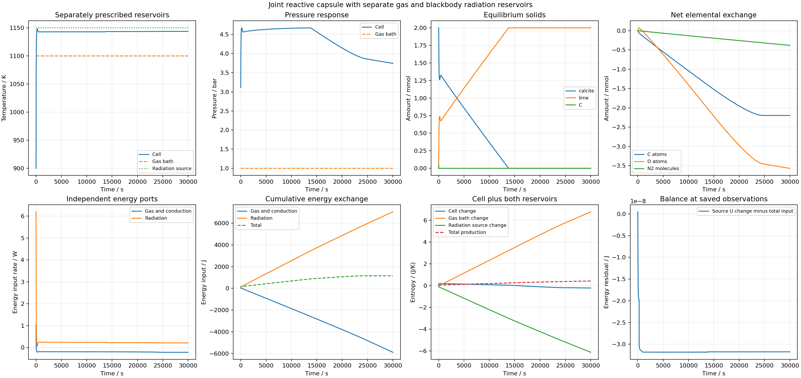

# 共同反应单元与独立气体、辐射热源

2026-09-25 UTC。正库存Ca/C/O刚性腔保留原来源热化学及虚拟气体输运，新增独立1150K黑体辐射库。气体库为1100K、1bar的规定含氧混合气；初始100cm³腔内Ca/C/O/N2=0.002/0.0022/0.0062/0.004mol，900K。黑表面、单位视角因子、1cm²受热端口均是明确的理想装置设定，不是砖坯发射率或测得表面积。

## 来源和系统边界

[NIST 2022 CODATA](https://physics.nist.gov/cuu/Constants/Table/allascii.txt)提供精确SI定义的kB、h、c及Stefan–Boltzmann常数。根参数保存三常数、公式 `2π⁵kB⁴/(15h³c²)`、80位来源推算和用于运行的有限浮点值；不会把印刷截断小数称为精确十进制。热化学继续使用USGS1995自身的历史R，未混用两套物性。

按[COMSOL官方辐射热流推导](https://doc.comsol.com/6.3/doc/com.comsol.help.heat/heat_ug_theory.07.047.html)的理想黑表面特例，输入热流为 `Aσ(Tr⁴−T⁴)`。运行采用等价因式分解，独立核查采用直接四次方。辐射库熵率为 `−Q/Tr`，体熵率增量为 `Q/T`，总熵产生为 `Q(1/T−1/Tr)`。这里核算物质与规定热库，忽略辐射场储能；没有把Q/Tr宣称为光子熵通量。维护外部气氛与温度的设备不在边界内。

## 先静态，再全过程

25组温度组合的80位常数/辐射热流/温度导数/熵核查、5组共同反应来源与能量/熵率全部通过。能量率最大差8.881785e-16W，熵率1.138412e-17W/K。首次静态JSON保存遇到NumPy布尔类型错误，原不完整JSON与stderr保留，v2仅修正布尔序列化。

两档30000s轨迹完成7272/7832步，实际15.313/16.439s。完整独立来源重建覆盖13273/13833个记录状态、43632/46992个Gauss节点、14544/15664次端点。逐步/累计元素、总能量、独立辐射与气体能量、体/两热库熵、2/4阶求积及6000时刻时间比较均通过原预算。

| 指标 | 基础档 | 精细档 |
| --- | ---: | ---: |
| 全局能量最大残差/J | 2.178540e-7 | 3.187381e-8 |
| 全局熵最大残差/(J/K) | 1.581288e-10 | 2.274936e-11 |
| 四阶累计体能量最大残差/J | 2.509969e-7 | 3.795117e-8 |
| 最小一步总熵变化/(J/K) | −3.574519e-12 | −2.997585e-13 |

微小负熵步仍记录在案，小于原1e-10J/K数值允许量；不宣称浮点步步严格非负。时间差最大T2.905813e-8K、P3.471796e-5Pa、相量2.531723e-13mol。辐射热流独立差1.776357e-15W，熵率差2.602085e-18W/K。完整审查首轮也因新增气体账标志为NumPy布尔而停止，stderr保留；v2修正保存类型后完成，未修改预算或物理参数。

共享审查入口新增显式 `radiation_kind`，旧算例根参数均明确为 `none`。原恒定气氛两档完整复算的每项轨迹审查和时间比较与原报告精确相同，见 `radiation-routing-parity.json`。

## 记录中的物理过程

保存观测中，方解石进入共存区在0–5s、石墨耗尽在5–10s、方解石耗尽在13785–13790s。这些只是5s观测括区，不是独立验证的精确相事件时间。

末态T1143.724380K、P374371.468Pa，全部0.002mol钙在石灰相，仍存2.421654e-6mol气相总碳；约99.889925%初始碳外排。持续气流与热交换尚在，不能称完成真实燃尽或达到稳态。

辐射累计输入7037.402196J，气体/导热通道净输入−5886.356067J，合计1151.046129J。体熵−0.2218441471J/K、气体库熵+6.7623438815J/K、辐射库熵−6.1194801701J/K，总熵产生+0.4210195643J/K。

运行入口 `run_carbon_calcium_radiative_cell.py` 配合根参数 `parameters.carbon_calcium_radiative_cell.json`；独立审查入口 `review_carbon_calcium_radiation.py`、`audit_carbon_calcium_open_cell.py`，完整结果为 `data/sandbox/research/carbon-calcium-radiative-cell-v1/full-audit-v2.json`。两条原始记录分别54946179/57857183B，压缩12822007/13574020B，逐字节无损还原一致。未新增/执行软件测试或SHA。

资格只限上述理想来源定义及数值预算。实际砖的发射率、气孔输运、有限反应速率、烧结收缩和同材料干湿至高温热学连接仍缺少；`material_qualified=false`、`training_eligible=false`。
