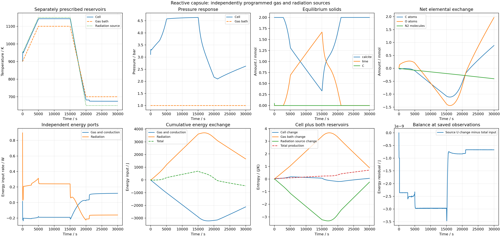

# 分开的气体与辐射程序：加热、冷却与再碳酸化

2026-09-25 UTC。按预先保存的[阶段计划](PLAN.md)和 `parameters.carbon_calcium_radiative_program.json`，在恒定独立热源完整资格通过后继续。本阶段同一100cm³虚拟Ca/C/O腔接收独立气体900→1100→700K、辐射950→1150→650K，以及富CO2→贫CO2→富CO2程序。物性、瞬时平衡、黑表面和虚拟输运的限定不变。

所有程序节点在0/5000/15000/20000/30000s，以实际物理时间计算；在节点重启积分。分别累计气体/导热与辐射的能量、两外界库熵和体熵，维护外部程序的装置不在模型边界内。

## 核查结果与保留的失败

11个边界时刻的独立60位仿射插值、来源Cp积分和化学势，加上辐射来源与共同能量/熵率，通过原预算。最大气体温差3.637979e-14K、辐射温差4.547474e-14K、化学势差1.048003e-10J/mol、辐射热流差2.596451e-16W。原恒定辐射的25组辐射和5组完整状态/率字段在共享计算后精确相同。

700/750/800/850K的初始库存热学及库存导数通过原独立60位来源核查。第一次根参数误写了未使用的 `temperatures_k`，实际沿用900–1150K；首份根参数、输出和显式修正后的v2均保留，没有把首份当作低温核查。

轨迹末温674.3426K，仍在原来源热容范围内。对实际末态模拟库存另核650/675/700K，原1e-7/3e-8相对库存差分使熵及气体化学势导数失败：残余O2仅约4.48e-7mol，原扰动的局部曲率影响不可忽略。误差随扰动缩小近似二阶。另冻1e-10/3e-11/1e-11相对扰动后，三个状态全部通过原预算，最大熵导数差3.285169e-12J/(mol K)，气体化学势库存导数差0.0062483J/mol²（原门槛0.01）。全部生产热学响应字段与该已核对研究响应精确相同。原失败完整保留；这三个点通过不解除其他极窄迹量共存状态的气体化学势Jacobian限制，实际积分仍仅用热学库存响应。

两档完整30000s轨迹分别8080/9197接受步，实际21.837/23.993s。完整审查覆盖14084/15201记录状态、48480/55182个Gauss节点及16160/18394次端点；来源、逐步/累计元素/U、分开的气体/辐射能量、体/两库熵、2/4求积及6000时刻时间比较全部通过原预算。

| 指标 | 基础档 | 精细档 |
| --- | ---: | ---: |
| 全局能量最大残差/J | 1.577678e-8 | 3.470745e-9 |
| 全局熵最大残差/(J/K) | 3.414558e-11 | 5.673240e-12 |
| 四阶累计体能量最大残差/J | 6.944339e-8 | 1.549088e-8 |
| 最小一步总熵/(J/K) | 6.573520e-12 | 4.131140e-13 |

时间比较最大T5.367826e-8K、P1.550786e-5Pa、相量1.249669e-13mol。记录边界与独立高精度程序温度相同，最大组成差5.551115e-17、来源化学势差3.492460e-10J/mol、辐射差1.387779e-15W。没有因新增热源放宽任何原预算。

## 过程含义

每5s保存观测显示：石墨在40–45s消失，2790–2795s进入方解石/石灰共存，冷却富CO2阶段在21030–21035s回到纯方解石。过程中方解石未全部耗尽，没有把相反方向的过程称为完全分解后再生。这些仅为观测括区，未作为独立高精度事件时刻或现实反应速度。

末态全部0.002mol钙为方解石，T674.342588K、P262675.876Pa；总碳0.0030839351mol，因外界供碳而超过初始库存。气相仍有CO2/O2/N2。辐射热流在保存观测中从正转负，范围−0.225974至+0.898223W。

累计气体/导热净输入−2115.533093J、辐射净输入+1652.698976J，合计内能变化−462.834116J。体熵+0.0580061891J/K、气体库熵+0.8943220150J/K、辐射库熵−0.2410413938J/K，总产生+0.7112868103J/K。热流反向不等于总熵产生反向。

运行与核查入口为 `run_carbon_calcium_radiative_program.py`、`review_carbon_calcium_radiative_program.py`、`audit_carbon_calcium_open_cell.py`，相应根参数均随Git保存。完整结果位于 `data/sandbox/research/carbon-calcium-radiative-program-v1/`。两条原始记录63770651/69773741B压缩为14919807/16395958B，逐字节还原相同。未新增/执行软件测试或SHA。

结果只给出规定理想装置的条件数值资格。真实砖的有限反应速率、实际输运和辐射性质、烧结收缩、同材料湿态至高温连接与最终质量仍未获资格；`material_qualified=false`、`training_eligible=false`。
