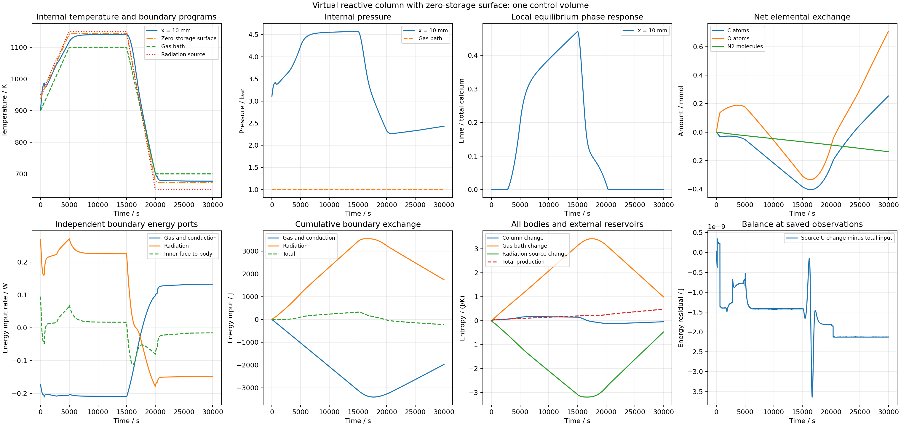

# 显式表面开放反应列：十六格全过程资格完成，空间未收敛

2026-09-25 UTC。在[零储量表面独立资格](../carbon-calcium-integral-surface-v1/REPORT.md)后，已接入同一100cm³总库存和30000s气体/辐射程序。外气膜连接到表面，半格内部关系连接表面至末格中心，辐射作用于表面温度。体仅接收内面流；外界能量账本记录外气能量和辐射。每条记录保留内/外面、表面状态及余额。原直接接触版本独立保留，不假定两种粗格模型应得到相同解。

## 静态装配与来源参考

1/2/4格18组非均匀库存和温度下，来源重建、各格C/O/N/U/S率、外界能量/熵和全体系熵关系达到原预算。最大局部库存率差9.661470e-22mol/s、能量率差1.318390e-15W、熵率差7.047314e-19W/K；全熵率余额5.710306e-16W/K。

为完整求积另写来源双精度表面参考：从原始来源积分重建各气体状态，不调用生产热化学提供器。它先与21组80位五未知量参考比较，T、P、化学势、组分流、能量/熵流全部达到原预算，结果保留为表面目录`static-review-v3.json`。双精度路径复用已独立证明的消元方程，并非第二套独立数学推导；独立五未知量求解仍是静态参考依据。

## 单格两档完整资格

30000s温程完成7159/7824步，实际22.247/23.948s。完整审查覆盖13163/13828记录状态、42954/46944个Gauss节点及14318/15648次端点。全部来源、表面逐组分/能量/熵闭合、每格和外界逐步/累计C/O/N/U/S、气体与辐射分账、2/4求积和时间比较均通过原预算。

全局能量最大残差1.806411e-8/3.639741e-9J，熵2.206246e-11/4.999334e-12J/K。四阶累计体U残差2.620355e-8/4.248349e-9J。最小一步总熵3.951284e-12/8.513190e-13J/K。6000共同观测的时间差最大T4.147444e-8K、P1.302606e-5Pa、相量8.355993e-14mol。

完整节点表面T为672.5872–1143.3962K，在所选来源范围内；体温度也通过各相来源交集核查。表面最大组分余额约6.77e-22mol/s、能量8.58e-13W、熵8.46e-16W/K。没有靠取消表面残差或重复计入辐射闭合总账。

精细档末体T677.032739K、表面T672.587164K、体P243149.809Pa；方解石恢复为0.002mol，石墨和CaO为零。记录到的最大表面—体温差45.477070K发生在16075s。两相/气体变化仍按瞬时局部平衡，不能解释为测得的砖反应速度。

原始记录86391835/91307258B，分块无损压缩19691937/20857083B，逐字节还原一致。图像已检查，可用根参数离线重建。

下一两格两档与1→2空间比较已按原预算冻结。几何、热/物质迁移系数和黑体端口均为明确虚拟定义；未获得实砖材料、有限反应动力学、变形或同材料全周期资格。`material_qualified=false`，`training_eligible=false`。

## 两格完整资格与首次空间比较

两档30000s分别完成8597/9980步，实际49.411/54.184s。完整来源、各格与外界逐步及累计C/O/N/U/S、表面两侧余额、气体/辐射分账、2/4阶求积和时间预算均通过。核查29202/31968记录单元、103164/119760个求积单元、34388/39920端点单元。全局能量残差7.916801e-9/2.566367e-9J，熵3.800649e-11/5.218020e-12J/K；四阶累计体U最大残差6.114685e-8/1.285031e-8J。最小一步总熵4.063416e-13/4.263256e-14J/K。

6000个共同观测的时间差最大T8.359905e-8K、P2.622133e-5Pa、相量1.002783e-13mol，全部达到原预算。所有节点表面T672.9988–1143.2920K，体最低676.2003K、最高1140.6976K，均处于所选来源范围。表面组分、能量、熵余额上界约7.91e-22mol/s、8.51e-13W、8.74e-16W/K。

1→2格在6001个共同观测下的空间差：均温和粗格温度15.708247K（16730s），均压8890.186629Pa（16030s），总相量2.015381e-4mol（17290s），四项均未达到0.05K/0.2K/100Pa/1e-8mol原预算。因此两格只有离散模型的完整物理账目与时间资格，空间资格未完成。四格两档及2→4比较已冻结原预算，正在完整核查。

两档记录144020638/159049560B，各三部分压缩至33749806/37572731B，逐字节还原一致。原始大文件由本目录忽略规则排除，版本库保留压缩记录、进度及全部成功/失败结论。

## 四格完整资格与2→4比较

两档30000s完成10767/13014步，实际110.012/127.670s；全部来源、表面、逐格/外界收支、分热源账目、熵、2/4求积与时间预算通过。67084/76072记录格、258408/312336求积格、86136/104112端点格纳入。全局U残差1.459849e-8/1.460526e-9J，S残差2.701572e-11/3.252398e-12J/K；四阶累计体U残差7.540115e-8/9.939662e-9J，最小一步总熵1.807443e-13/9.148238e-14J/K。时间最大T差2.285578e-7K、P差4.933332e-5Pa、相量差1.221069e-13mol通过。

完整节点表面温度673.3729–1143.4294K，表面物质、能量和熵余额分别不超过1.39e-21mol/s、7.59e-13W、8.45e-16W/K，来源温区也通过。2→4空间6001观测的均温5.917568K、父格温度7.410225K、均压18708.185Pa、总相量1.707052e-4mol四项仍失败；均压差相较1→2增大，不能宣称全部指标单调收敛。父格压力38317.468Pa仅为诊断值，无另加门槛。

两档记录276731706/316734013B，各五块压缩至67783250/77607264B，逐字节还原一致。八格阶段已在原参数/预算下冻结并启动。真实材料与全过程资格保持未通过。

## 八格完整资格与4→8比较

两档30000s完成13581/16752步，实际316.296/372.486s。完整来源、表面各组分/U/S、逐格和外界收支、分热源账目、2/4求积和时间预算全部通过。156680/182048记录格、651888/804096求积格、217296/268032端点格纳入。全局U残差9.567650e-9/4.501601e-9J，S残差2.801537e-11/2.367218e-12J/K；时间最大T差2.140873e-7K、P差1.057731e-4Pa、相量差1.404762e-13mol通过。

所有节点表面温度673.6479–1143.4316K；表面物质/U/S余额不超过2.29e-21mol/s、1.606e-12W、1.422e-15W/K，全部满足原预算。4→8空间6001观测仍四项失败：均温3.658048K、父格温度5.542851K、均压9575.191Pa、总相量1.217062e-4mol。父格压力39108.513Pa仅为诊断值。下一十六格参考仍采用原SciPy差分，独立Jacobian改进阶段尚未取得完整轨迹资格。

两档原记录583309303/684021980B，9/11部分压缩至146631826/172466865B，逐字节还原一致。空间与真实材料资格仍未通过。

## 十六格完整资格与8→16比较

两档19614/24976步、1311.603/1658.259s；来源、表面、逐格/外界C/O/N/U/S、独立热源账目、熵、2/4求积与时间预算全部通过。409888/495680记录格、1882944/2397696求积格、627648/799232端点格纳入核查。全局能量残差1.617327e-8/2.023115e-9J，熵9.874269e-12/1.265100e-12J/K；6000时刻时间差T4.962245e-7K、P2.072089e-4Pa、相量1.387952e-13mol。

全部节点表面T673.814387–1143.447987K；表面组分/U/S余额不超过4.125977e-21mol/s、1.998784e-12W、1.880549e-15W/K。8→16空间均温1.288780K、父格T3.274396K、均压3770.562517Pa、总相量1.253308e-4mol仍全部失败，父格P32102.034933Pa只作无预算诊断。两档406265581/498069617B压缩记录共22/27块，逐字节还原一致。

冻结32格两档与16→32比较，保留原全部预算。独立自适应导数变体的八格全过程已通过等价核查，但没有显示性能收益，本空间阶段继续使用原稀疏数值差分。仍无实砖、有限反应速度或完整烧结周期资格。
