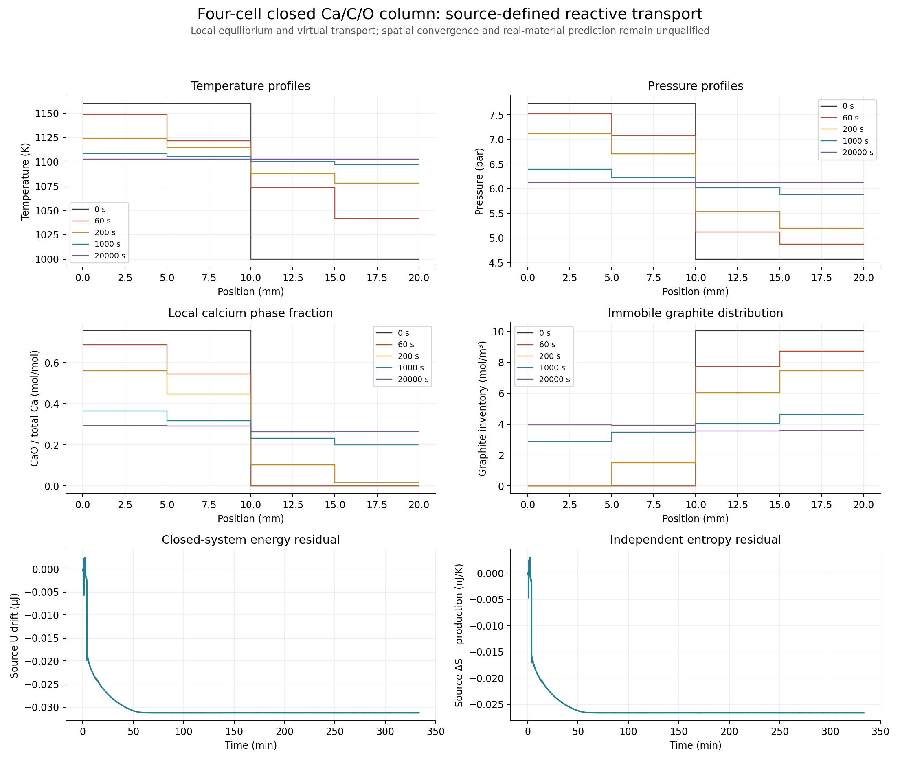

# 直接温度坐标：独立数值路径

先前守恒坐标基线全部保留。已核查的同相容量关系`dU=Cv*dT+U_C*dC+U_O*dO+U_N*dN`给出等价温度ODE；相平衡、物种/热输运、体积、初态及物理误差预算都不变。温度路径不积分U，只从来源状态重新计算U，因此必须重新满足全局和逐格能量预算。

七个已记录物理时刻的源状态与物种/熵率完全相同，重新组合能量率差1.324e-23W。公平单次解码剖析.3237→.03485s，只属本组选点和当前负载；第一次诊断重复调用旧解码的脚本/输出保留并明确不用于比较。

新两格20000s的数值策略事先明确为相对1e-11、温度绝对1e-9K，精细档全部缩小10倍；库存密度绝对容差沿用原值，累计熵绝对1e-13J/K。使用SciPy数值Jacobian与局部依赖稀疏结构，未假装已有温度容量二阶导数。温度坐标和守恒坐标的稠密多项式含义不同，审计根参数必须明确选择；所有输出仍单独记录来源U变化。

第一版用继承复用几何，但同时暴露了只适用于守恒坐标的Jacobian接口。运行器实际只使用数值Jacobian，未调用该接口；最终类改为组合，重新运行并保存`two-v2-*`。原型两条记录亦保留，不能把未核查的原型当作最终动态资格。

## 两格首轮完整验证：基础档有失败

最终类两档分别1300/1434步、15.05/16.04s。本次守恒坐标对应基线为105.70/117.22s；时钟含当时并发负载，只代表这些算例。来源、逐格元素和U、累计熵、2/4求积、时间比较及守恒坐标对照均通过原预算。来源总U最大漂移3.537e-7/4.214e-7J，预算1e-5J；不同坐标并不保持相同的有限步能量误差。

基础档在178.161014816→178.161018318s石墨从耗尽转为出现时，来源总熵一步变化−1.404315e-10J/K，超过原−1e-10J/K允许余量，因此整组资格失败。该步积分耗散仍为正2.936226e-11J/K，来源U漂移−1.904746e-7J；这说明需要审查数值相切换，不能把正耗散ODE当作离散熵已经通过。精细档最低步熵−6.071277e-11J/K，全部原预算通过。最差步的前后完整状态另存`negative-step-review.json`。

1000个共同观测的两档最大T/P/相量差5.030e-8K/.00022838Pa/1.830e-12mol；精细与守恒基线差5.147e-8K/.00029123Pa/2.334e-12mol。原失败与参数不覆盖。进一步显式缩小各积分容差10倍，比较原精细与新增更细轨迹；物理预算不变。完成前不授予两档动态资格，也不启动四格温度路径。

## 精细与更细两档资格通过

更细实际相对容差1e-13，1664步、17.61s；完整5330个记录格状态和19968个稠密格状态核查通过。来源总U最大漂移1.652e-8J，累计逐格U残差1.948e-8J，累计逐格熵残差1.854e-11J/K；最低一步总熵−7.710e-13J/K，全部符合原预算。基础失败未删除，资格只属于原精细和新增更细两档。

后两档1000个共同观测最大T/P/相量差3.937e-8K/.00022423Pa/1.797e-12mol；更细与守恒精细基线差3.416e-8K/.00006946Pa/5.565e-13mol，均通过。五条完成轨迹（含未单独审计的原型两条）分别无损分片并逐字节还原核对；原型与最终类的资格不混用。

随后四格使用更细根策略的基础/精细档（实际1e-12/1e-13），独立核查完整U/S和时间收敛，再与原守恒四格比较。两格→四格空间预算保持原值。当前只两格温度路径资格完成；适用范围仍是来源定义的理想气体、常体积纯固相、局部瞬时平衡及虚拟输运，并非材料准确性。

## 四格动态与跨坐标对照通过

四格两档1812/2143步、39.35/45.77s，完整11252/12576个记录格状态和43488/51432个稠密格状态的来源、局部元素/U/S、熵产生和2/4求积预算全部通过。基础/精细最大全体系U漂移1.753e-7/3.127e-8J，最大累计逐格U差2.398e-7/2.592e-8J，最低步熵−1.743e-11/−8.793e-13J/K。原物理预算未改变。

1000观测点的时间比较最大T/P/相量差2.681e-8K/.00015359Pa/6.152e-13mol；精细与守恒四格基线差1.641e-7K/.00020426Pa/8.160e-13mol，全部通过。相同四格算例的守恒路径实际273.02/295.67s；仅对这些记录说明直接T路径较快，不能推广为所有网格或材料的性能保证。

两格更细→四格精细的空间指标仍全部失败，与守恒路径的3.773823K平均温差、14.951726K父格温差、282.996641Pa平均压差及1.119905e-4mol总相差相符。四格全程和压缩归档完成后，在相同条件和原预算下继续八格两档。

图中阶梯是记录网格的分片常值，未通过插值制造细空间信息。固体分布在温度接近均匀后仍可不同；固体不迁移，已核查的均匀态模态也允许这些自由度。图像不代替全步审计。

## 八格完整时间资格，空间四项仍失败

八格基础/精细2267/2714步、113.73/130.00s；26144/29720记录格状态及108816/130272稠密格状态的全来源、逐格元素/U/S、2/4求积及熵核查通过。基础/精细最大全体系U漂移2.154e-7/4.911e-8J，累计逐格U差1.181e-7/3.929e-8J；最低步熵−7.414e-11/−7.632e-12J/K，均符合原预算。1000共同观测时间差T2.310e-8K、P.00013058Pa、相量2.616e-13mol，均通过。

四→八格1001观测空间最大平均T2.175696K、父格T12.123749K、平均P413.229324Pa、各相总量4.343590e-5mol，全部超原目标；逐格P15599.600Pa仍仅报告。平均P误差没有单调减少，不能从部分指标变小推断已处于统一渐近收敛区间。两档压缩字节21832552/25174477，逐字节还原一致。

继续更细网格前，定位到累计熵一行对所有单元的依赖使数值Jacobian失去局部分组优势。三处八格记录状态的数值局部块使用32组全结构或12组三格周期结构时结果完全相同；实际RHS评估33→12次。解析熵行从已核查面导数作坐标链式转换，192个同相方向/步长的独立来源差分全部通过，最大缩放导数差2.170e-14W/K。数值块计算阶段实测约.34–.38→.12–.14s，后者未计额外解析熵行，因此不能代表完整Jacobian提速。该优化尚在独立全过程轨迹核查，不以逐点结果提前授予动态或更细空间资格。

## 局部数值块与解析熵行：八格全过程资格通过

新路径仍用SciPy原`num_jac`自适应差分尺度，只有局部体变量参与周期分组；总熵账本不反馈体状态。熵行来自同相面导数与`dU=Cv*dT+U_C*dC+U_O*dO+U_N*dN`链式转换。零账本反馈列直接由方程结构给出。未假设温度容量二阶导数为零，也未修改物理系数。运行头记录SciPy版本，私有数值接口的依赖明确保存。

八格基础/精细2280/2706步，100.15/115.14s；26248/29656记录格状态和109440/129888稠密格状态全审计通过。全体系U漂移≤2.007e-7/5.244e-8J，累计逐格U差≤1.905e-7/2.971e-8J，最低步熵−1.394e-11/−2.108e-12J/K。所有原物理预算均保持。

1000观测点的时间差T5.179e-8K、P.00027487Pa、相量5.505e-13mol；精细与旧八格精细差T3.932e-9K、P.000022234Pa、相量4.456e-14mol，全部通过。完整轨迹计时相比旧113.73/130.00s有约12%缩短，仍只属当前条件和并发负载。两档压缩21885552/25104605字节，逐字节还原一致。资格完成后继续十六格两档，空间目标不变。
