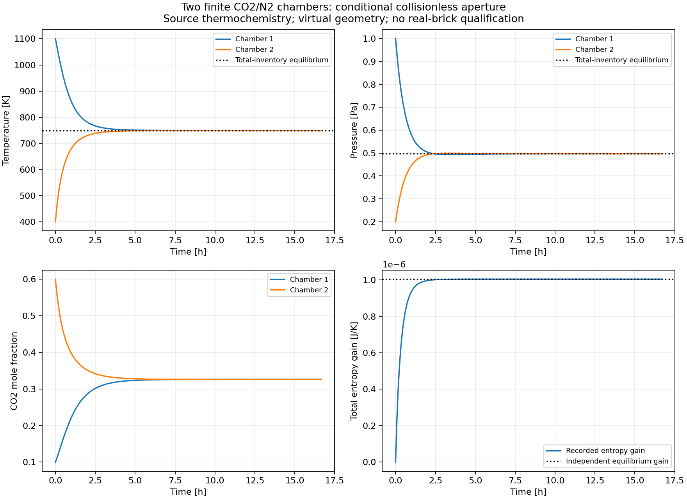

# 有限双气室：分子流与完整库存能量衔接通过

2026-09-25 UTC。在[已核小孔分子流极限](../effusive-gas-limit-v1/REPORT.md)上，完成两气室60000s共同CO2/N2与能量交换。两档积分均通过整段来源、逐室物种/U、熵及独立平衡目标，时间对照通过。这是理想无碰撞小孔、局部均匀平衡气体和虚拟几何的条件过程，不能直接当作真实砖孔流动。

## 先固定的过程

1L气室初态1100K、1Pa、CO2摩尔分数.1；1.5L气室初态400K、.2Pa、CO2摩尔分数.6。两室固定体积，孔面积1e−9m²，无外界热、功或物质。源温区298.15–1200K，热化学和质量来源见上游报告。真实孔道碰撞、壁面适应及宏观混合条件没有实验资格；这些假设在运行前的[设计](DESIGN.md)与根参数`parameters.effusive_gas_chambers.json`中声明。

每室温度由固定体积的U=Σn(h−RT)反演；同一面使用h−RT/2的速度加权出射能，两侧反号入账。保留生成焓和混合熵。两室总物种及U决定全局平衡温度，平衡物种按体积分配，不用积分末态拟合参考。

## 实际核查结果

两档分别3013/3018个接受步，审查12028/12038个格状态，以及每个完整时间间隔的2/4点Gauss积分。审查直接积分源Cp和Cp/T重建状态，以Maxwell速度矩重建面流；稠密节点的温度反演仍使用生产路径，此独立性限制明确保留。

| 量 | 实际最大差/残差 | 原预算 |
|---|---:|---:|
| 源内能重建 | 1.42e−16 J | 1e−11 J |
| 两档全程局部能量积分 | 1.68e−11 J | 1e−8 J |
| 两档累计逐室能量积分 | 5.60e−11 J | 1e−8 J |
| 两档累计逐室物种积分 | 1.71e−16 mol | 1e−13 mol |
| 两档累计逐室熵积分 | 9.78e−14 J/K | 1e−10 J/K |
| 时间对照格温差 | 1.92432e−6 K | .001 K |
| 时间对照格压差 | 1.82088e−9 Pa | 1e−6 Pa |

时间比较使用全部3001个共同20s采样点。完整来源面流与记录的差别也满足轨迹头中冻结的小孔静态预算；没有按动态结果修改预算。最小记录熵增−2.71e−20J/K，处于1e−13J/K舍入允许范围，不把浮点负数删掉或称为严格逐步正数。总熵未超过独立全局平衡熵。

独立平衡解为749.088433814K、.497122324Pa。60000s末态距离该解最大温差约.000103243K、压力差1.41552e−7Pa、物种差2.06813e−14mol，均达到预先.1K/.0001Pa/1e−10mol目标。有限末态接近平衡，未宣称数学上恰好等于平衡。

初次两条审查在结果序列化时因NumPy布尔类型退出1，半写入JSON和stderr保留，不能算完成。显式转换布尔类型，并把已冻结面率预算纳入汇总后，从头重新审查得到上述完整结果；见`audit-correction.md`。物理方程和误差门槛没有因此改变。

## 交付范围

核心为`recorded_ideal_gas_cell.py`与既有`effusive_gas_face.py`，运行/审查/比较/作图分别有独立研究入口；完整证据在`data/sandbox/research/effusive-gas-chambers-v1/`。两条原始轨迹压缩共7606970字节，`archives.json`记录逐字节解压回读一致。图形已由实际记录生成；没有软件测试或校验和操作。

这一阶段提供有动力学理论来源的分子流极限与能量核，不提供孔道连续流—分子流过渡、吸附壁、实际砖输运系数或固体反应有限速率。真实材料的这些依赖以及M1留出数据仍在。`material_qualified=false`，`training_eligible=false`。

## 独立温度反演与完整时间并集补强

后续`independent-full-audit.json`以60位原始USGS系数字符串独立积分并用高精度割线法反演温度，不导入生产热化学、气室或求根代码。两档6014/6019条记录、18078/18108个稠密节点的全来源/逐室N/U/S及累计通量审查通过。记录温度与独立反演最大差4.77485e−11 K；源反演内能残差≤4.86174e−63 J是数值计算精度，不是物理不确定度。

两档接受点、2/4点Gauss点及输出点的并集45174点全部比较：最大温差1.93613e−6 K、压力差1.83738e−9 Pa、物种差1.87116e−16 mol，均通过原预算。旧3001个输出点对照保留。现在的完整收支不再依赖生产温度反演；仍不声称连续时间误差上确界或真实装置验证。所有原预算保持不变。
