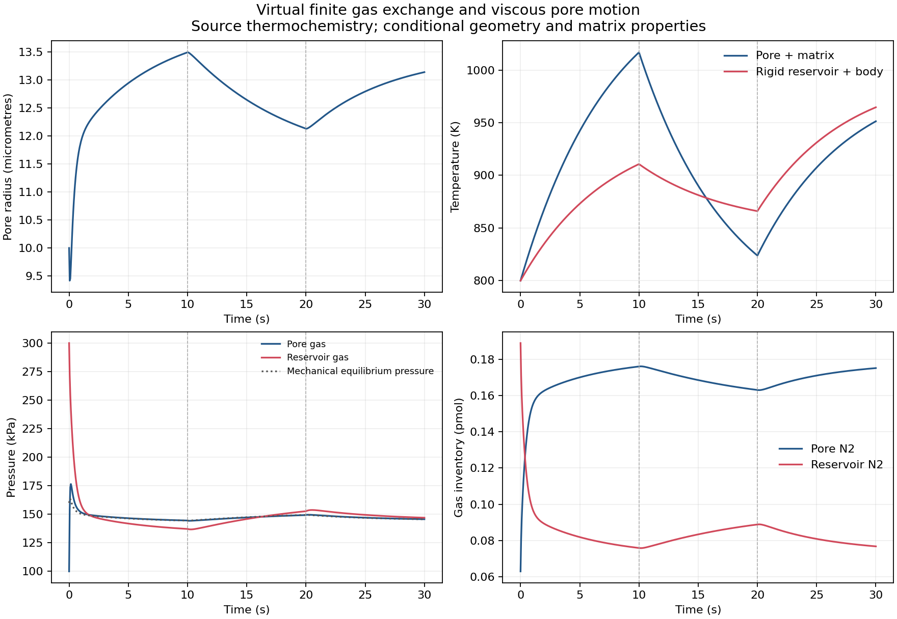

# 可变孔隙与有限气室：气流、热量和收缩功共同记账

36 个静态状态完成60位来源重建和独立能量/熵梯度核查；四种30秒过程采用收紧精度后的两档共八条轨迹，完整来源、局部/整体物质量、内能/熵、2/4求积与时间比较均通过原预算。初始较松精度的失败全部保留。资格仅限所声明的条件模型。

本阶段把已有的纯N₂变温球孔与自由分子交换关系连接到一个有限、刚性的N₂气室。球孔外表面承受指定压力，基体不可压缩、黏度及表面张力为常数；两个气体空间各自保持热平衡，并有明确的集中储热体。几何、基体热容量、黏度和热边界都是根参数文件中的虚拟装置输入；气相Cp/H/S沿用USGS1995原始系数和历史R，不混用NIST Shomate参考。这不是2016玻璃试样，也没有授予实际砖资格。

连接是面积相对于孔壁可忽略的零厚度理想分子流口。它在模型中作为能量和物质端口，忽略小口对球对称应力、表面能和口缘的扰动。实际烧结砖的有限长度曲折孔道、壁面碰撞、孔闭合和渗透率演化尚未由此得到。名义LJ直径下的平均自由程与端口半径比例被记录为条件诊断，不当成实际孔道误差证明。

令J为从孔到气室的净摩尔率，E为同方向能流。Maxwell分子流带走的每摩尔能量为h−RT/2，不能直接用普通连续流焓h。库存满足 dn_p/dt=−J，dn_r/dt=J。

孔气体与基体共同温度满足

(C_m+n_p c_v)dT_p/dt = Q_p−E+u_p J−p_p dV_p/dt+D。

刚性气室及其储热体满足

(C_r+n_r c_v)dT_r/dt = Q_r+E−u_r J。

这里D为黏性耗散，球孔机械式同时给出 d(γA)/dt=(p_p−p_out)dV_p/dt−D。因此包含两边气体、两储热体和孔表面能的总内能满足 dU/dt=Q_p+Q_r−p_out dV_p/dt。内部气流和黏性耗散不再额外加到总外部供热账本中。

总熵产生由三项组成：D/T_p、两个热源的 Q(1/T−1/T_bath)，以及分子流 E(1/T_r−1/T_p)+J(μ_p/T_p−μ_r/T_r)。静态核查使用独立边界应力解、源热函数及总U/S对半径、两个温度、两个库存的高精度梯度；最大能量率残差1.947e−22W、熵率残差2.866e−25W/K。不是只核对代码里重复定义的同一个残差。

首轮结果写出时 NumPy 布尔值不能序列化，原部分JSON和stderr保留；交换熵率明确转换为普通标量后，完整36状态结果在 `static-review-v2.json`。物理参数与预算未改。四个过程分别从气体净流入/流出条件出发，采用绝热或两个不同热源的加热—冷却—再加热边界。终点不被假定为最终热平衡。

完整审查入口为 `audit_effusive_spherical_pore.py`，包括全部保存状态、每接受步的2/4阶积分、内外能量/熵、物质量以及两档共同时间节点比较。参数与预算分别在 `parameters.effusive_spherical_pore.json` 和 `parameters.effusive_spherical_pore_audit.json`。没有新增或运行软件测试，没有SHA。material_qualified=false，training_eligible=false。

## 完整结果与保留失败

初始八条轨迹都算到30s，但七条累计局部物质量积分超过1e−22mol，四个时间比较也均超过1e−22mol；最大累计差约1.146e−21mol，时间差约2.015e−22mol。这些不能因总物质量守恒接近机器精度而被忽略。原结果为 `full-audit.json`，没有放宽任何门槛。

新参数 `parameters.effusive_spherical_pore_tightened.json` 只把基础相对/归一化绝对容差收紧为1e−12/1e−14，精细档再乘0.1，物理输入与全部预算保持不变。`tight-full-audit.json` 的八条完整轨迹全部通过；审查累计43177次保存状态检查、76722个稠密求积节点，四个时间比较合计91897个共同并集节点。最大整体内能残差1.164e−19J、熵残差5.477e−20J/K、总摩尔量残差6.107e−28mol；最大时间差为半径3.038e−16m、温度6.962e−11K、气体量4.930e−24mol、压力1.275e−5Pa。

这说明气体交换带来的组成热储项 `u·dn/dt`、气流能量及收缩功在本模型内相容；不保证端口近似或恒黏度能准确描述实砖。四条精细轨迹已记录状态中的最小名义平均自由程/口半径约12.64，口面积/球孔面积最大约7.10e−8。前一数值只是用LJ直径作硬球估计的适用性诊断，不能据此给出真实气体或孔口误差界。

流入加热循环中，孔先由10μm短暂缩至约9.389μm，再随进气和加热膨胀到约13.495μm，冷却时又缩小；没有把所有温度升高都强制变成致密化。两个气体温度不同时，其压力也可不同。这个结果是条件装置的预测，不是玻璃或砖的实测曲线。

图的PDF版本一并保留。包括原失败在内的16条完整轨迹共161053423原始字节，归档为36409377字节，全部逐字节还原相同。压缩归档完成不改变原失败的科学判定。
