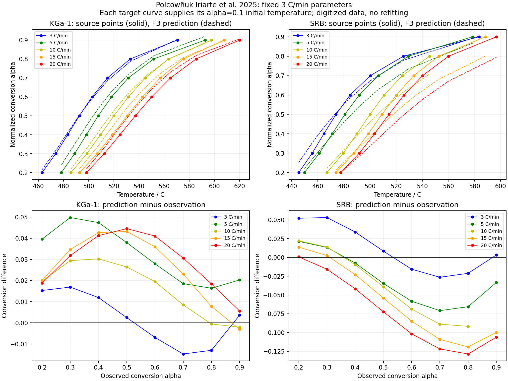

# 高岭石脱羟：公开原图与跨升温速度对照

本阶段增加可追查的现代公开实验对照及 F3 速率计算。计算本身通过独立求积与精度比较，材料预测并未因此获得资格。固定同一组低速实验参数后，工业高岭土 SRB 在更高升温速度下出现超出原图读取包络的偏差。`material_qualified=false`，`training_eligible=false`。

## 来源与数据身份

[Polcowñuk Iriarte 等，2025，Minerals 15:607](https://doi.org/10.3390/min15060607)的作者原文和[Izadifar 等，2020，Clays and Clay Minerals](https://doi.org/10.1007/s42860-020-00082-w)的 KIT 公开原文均取得并保留 CC BY 4.0 副本。数据、材料准备、页码、单位和适用范围写入 `source-contract.json`。

2025 实验为约 20 mg 的 KGa-1 或 SRB 粉料、铂坩埚、空气中以 3/5/10/15/20°C/min 升至800°C。KGa-1 的高岭石约96 wt%；SRB为76.6 wt%高岭石、22.0 wt%石英及1.4 wt%钾长石。气流、湿度和试样内蒸汽分压未给出。归一化转化率以400°C质量作为起点、700°C质量作为终点，不能直接称为砖体总失重。

从 PDF 原有的 RGB 位图直接提取 Figure 4/6，没有重新渲染或缩放。根参数保存坐标刻度、精确曲线颜色、扫描宽度、读数范围和参数点中心。Figure 4 中90个指定读数有89个可读取；SRB 10°C/min、α=0.9处相应颜色被遮挡，标成不可读取，未插值补造。初始窄扫描版本保留在 `digitized.json`；正式使用 `digitized-axis-band.json`，竖向范围包含轴线与像素定位范围。

源论文只给出 Figure 6 的 E/A 点，未取得原始仪器数组、精确参数及协方差。参数误差棒被圆点遮住。报告分别计算中心读取范围，以及包住圆点半径加读取范围的宽矩形包络；**二者都不是实验置信区间**。矩形包络也没有假装已知 E/A 的正相关程度。

## 条件对照的设计

实现 `dα/dt=A exp(−E/RT)(1−α)³`；累计暴露量可解为

`α=1−[(1−α₀)⁻²+2∫k dt]⁻¹/²`。

原文A明确为min⁻¹，E为kcal/mol；计算声明热化学kcal=4184J、R=8.31451J/(mol K)和273.15K摄氏偏移，不以隐藏的常数差异调参。图上3°C/min参数中心约为：

| 材料 | E / kcal mol⁻¹ | log₁₀(A / min⁻¹) |
|---|---:|---:|
| KGa-1 | 55.293 | 15.1435 |
| SRB | 36.102 | 9.8426 |

所有曲线固定使用该材料3°C/min参数，没有为其他升温速度重新拟合。因为原拟合仅限α=0.1–0.9，每条目标曲线提供自身α=0.1时的温度作为初始条件，随后预测其α=0.2–0.9观测点。这样只核对后续区间形状，**没有独立预测起始温度，也不是整条曲线的盲测**。3°C/min属于同一拟合曲线的重建，其余属于同研究内条件迁移。

## 实际结果

| 材料 | 升温°C/min | 对照点 | 平均绝对α偏差 | 最大绝对α偏差 | 中心读取包络覆盖 | 宽包络覆盖 |
|---|---:|---:|---:|---:|---:|---:|
| KGa-1 | 3 | 8 | 0.01061 | 0.01689 | 8/8 | 8/8 |
| KGa-1 | 5 | 8 | 0.03222 | 0.04979 | 4/8 | 8/8 |
| KGa-1 | 10 | 8 | 0.01705 | 0.03024 | 8/8 | 8/8 |
| KGa-1 | 15 | 8 | 0.02630 | 0.04322 | 4/8 | 8/8 |
| KGa-1 | 20 | 8 | 0.02899 | 0.04454 | 3/8 | 8/8 |
| SRB | 3 | 8 | 0.02671 | 0.05304 | 4/8 | 8/8 |
| SRB | 5 | 8 | 0.03811 | 0.07086 | 3/8 | 8/8 |
| SRB | 10 | 7 | 0.04774 | 0.09176 | 3/7 | 6/7 |
| SRB | 15 | 8 | 0.06322 | 0.11912 | 3/8 | 6/8 |
| SRB | 20 | 8 | 0.07360 | 0.12853 | 2/8 | 5/8 |

宽包络的覆盖不等于实验通过；没有完整观测误差或事先材料验收标准。本阶段保留各点偏差，尤其SRB在10/15/20°C/min仍有合计6个点超出宽包络。来源自身也指出参数随升温速度变化、全区间无法由候选模型线性化。不能由高R²直接认定唯一机理或可随意移植的速率。

79个对照点均完成60位独立温度求积以及两档DOP853直接微分方程计算，最大独立α差2.759e−15，两档最大差1.444e−15，均低于事先1e−9预算。这证明所声明方程的数值实现达到预算，不能消除上表的材料偏差。没有新增或运行软件测试，没有SHA操作。

## 2020来源提供的内容与尚未解决的问题

Izadifar实验明确给出100mg、5mm×5mm带孔盖Pt/Rh坩埚、10°C/min及气流，可以补充实验条件和部分脱羟结构证据。但材料是KBE1_M2/KGa-2及地开石，与2025的KGa-1/SRB不同。其干基失重和Figure 4理论失重百分比的归一化关系仍需确认；方法温程到1100°C，而图和后文涉及1400°C，也不能静默拼成一个温程。

两篇的DFT计算都没有补齐项目需要的偏高岭土绝对H/S/Cp随温度关系。2020用相近熵贡献假设近似自由能；2025比较放松结构的反应能，不能把它当作过渡态活化势垒或实测反应热函数。因此本阶段仍没有把F3或一阶经验速率乘上任意产物反应热接入砖体能量方程。

下一步材料准入需要可读原始热重/量热、误差和同试样温程对照，以及一致的产物热储。M1公开黏土干燥与MIA3含污泥配方的缺项保持不变；本阶段不替换它们的材料身份。

## 复现

根配置为 `parameters.kaolinite_modern_validation.json`。依次运行 `digitize_kaolinite_modern_figures.py`、`review_kaolinite_modern_transfer.py`、`plot_kaolinite_modern_transfer.py`，指定参数、已保存读数和新的输出路径。原文与提取图均已随研究目录保存，运行无需联网。
