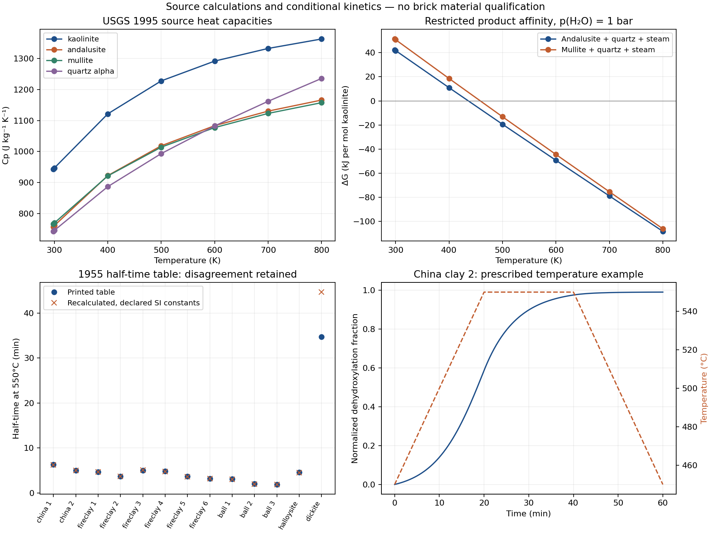

# 高岭石热化学与文献脱羟速率：分开验证

本阶段新增同源高岭石/结晶产物热化学和一个指定温度的脱羟比例计算。数值核查通过；偏高岭土热储与自由能、同一试样独立实验对照和砖体耦合仍未完成。`material_qualified=false`，`training_eligible=false`。

## 热化学定义与核查

直接读取并目视核对 [Robie & Hemingway 1995, USGS Bulletin 2131](https://pubs.usgs.gov/bul/2131/report.pdf) 的七页原表，提取高岭石、红柱石、莫来石和低温石英。新增来源与计算均限于共同的 **298.15–800 K**。水蒸气沿用已核查的同一本书来源。参考压力1 bar、R=8.31451 J/(mol K)保持一致；不混入1981汇编的1 atm定义。

焓由298.15 K生成焓加Cp积分，绝对熵由参考熵加Cp/T积分；不能直接把各温度下“从元素生成”的表列焓当作显热坐标。四相28个温点的60位独立积分与运行公式一致：最大焓差4.7022e−10 J/mol、熵差2.0414e−13 J/(mol K)。精确有理数多项式界覆盖共同温区并给出正Cp。

84个表字段中，石英两个值超出表格自身末位半单位；计入打印系数及参考熵的舍入范围后，84项均覆盖。保留前一种失败；舍入包络不是物性实验误差，也不是材料预测区间。

原文有两处需要显式解释：高岭石p382写成Al₂Si₂O₅(OH)₂，而p39/65的Al₂Si₂O₅(OH)₄与258.160 g/mol相符，本阶段采用后者并保留原页；USGS石英转变温度844 K与项目既有NIST版本847 K不同，本阶段止于800 K，没有替换原石英转变模型。

## 限定反应自由能，不能当作烧成发生温度

两条反应按整数元素严格配平：

- Al₂Si₂O₅(OH)₄ → Al₂SiO₅ + SiO₂ + 2H₂O(g)
- 3Al₂Si₂O₅(OH)₄ → Al₆Si₂O₁₃ + 4SiO₂ + 6H₂O(g)

反应H/S/G、G的温度导数及van't Hoff关系均通过独立积分/微分核对。下表仅为这两个**指定结晶产物集合**的ΔG=0界限；固相用源标准态、气相用理想蒸气。没有包含偏高岭土、其他矿相或液水竞争，因而不代表全局平衡或实测脱羟起始。

| H₂O分压 | 红柱石+石英路径/K | 莫来石+石英路径/K |
|---|---:|---:|
| 1000 Pa | 348.695286 | 369.643036 |
| 10000 Pa | 387.310269 | 409.081323 |
| 100000 Pa | 435.859423 | 458.275685 |

六个根与60位独立积分求根最大差2.312e−12 K。这个数值精度不代表源参数准确到这些位数。它说明热力学驱动力与实际转化路径/速率必须分别处理，不能把平衡相分配直接叫作真实黏土烧成过程。

## Vaughan 1955：保留参数表的失败

从 [Vaughan 1955 原文](https://doi.org/10.1180/claymin.1955.002.13.08) 提取13行E、log₁₀A及550°C半反应时间。所用试样经过具体筛分或预处理，恒温研究范围为450–550°C，地开石为550–650°C；这些事实保存在`vaughan1955-source.json`，不能移植成任意砖坯参数。频率因子的min⁻¹由时间坐标和公式解释，原A列没有写单位；cal定义及R数值也未明确。

采用声明的热化学cal=4.184 J、R=8.31451和273.15 K偏移时，11/13行在参数与表值打印范围内相容；球土1和地开石失败。单独记录旧常数示例R=1.987 cal/(mol K)、273 K偏移，12/13相容，但地开石仍失败。原34.7 min对比约44.6666或45.0495 min，未把原值改成“可能的勘误”，也未拟合E/A使其通过。该半反应时间本来就是作者由同一速率常数计算，**不构成独立现实验证**。

热化学原文中部分生成焓是估算，且不同历史来源差异大。它们没有拼接成项目的偏高岭土势函数。[2023综述](https://doi.org/10.1039/D3TA01896B)用于追索参考资料；Schieltz1964原文未成功取得，Ren会议量热论文仅有摘要，均未输入其未核实的数值。

## 已实现的有限速率示例及边界

`RecordedFirstOrderDehydroxylation`实现k=A exp(−E/RT)、dα/dt=k(1−α)，并用累计暴露量积分α=1−exp(−∫kdt)。选择原文Cornwall China clay 2，输入参数不拟合。五个恒温速率、两档DOP853及60位独立求积的241个时间点全部达到事先预算；最大α参考差2.554e−15，两档时间差2.887e−15。

450→550°C用20 min、保持20 min、再20 min回到450°C的程序是**人为指定的数值示例**，不是原论文实测温程。该模型给出末态α≈0.989480；550°C恒温20 min给出α≈0.938568。原拟合来自恒温实验，变温使用还未获独立观测验证。此处α仅为该经验一阶模型的归一化脱羟进度，不给砖坯总失重、反应热或强度。

尚未提供蒸汽抑制、逆反应、产物势函数、颗粒内部温差及砖体传输。尤其不能把这条单向速率与另一个结晶产物反应热随意相乘，宣称能量/熵耦合已经正确。下一步需要同一反应产物定义、适用温区热储和独立TGA/量热数据，之后才可接入自洽能量方程。

## 文件与复现

根参数：`parameters.kaolinite_source_review.json`、`parameters.kaolinite_reaction_boundaries.json`、`parameters.vaughan1955_kinetics.json`、`parameters.kaolinite_source_plot.json`。原表、来源访问状态和结果位于`data/sandbox/research/kaolinite-source-review-v1/`；四个同名review/plot脚本位于`examples/sandbox/`。输出以新路径生成，保留原失败；运行不联网。

已执行源页目视核对、热化学与速率数值复算、时间精度比较、结果图查看。没有新增或运行软件测试，没有SHA操作。有限速率模块没有连接M1真实黏土或MIA3目标配方。
