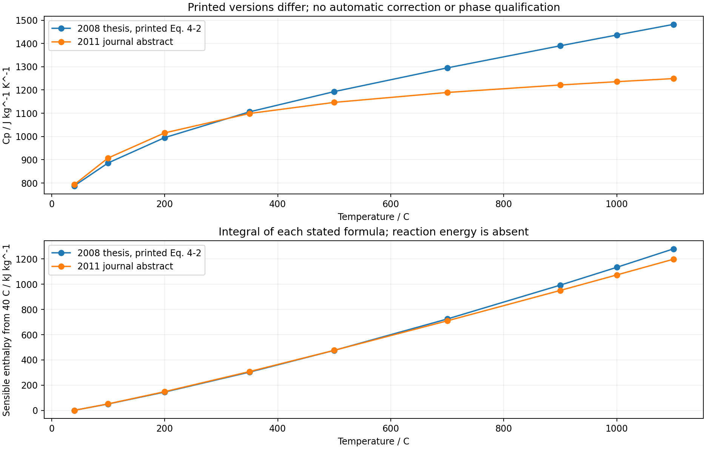

# 脱羟后热容：来源版本差异与限定显热计算

新增质量比热多项式及相对焓/熵积分，数值复算通过；未给偏高岭土反应能量模型授予资格。源公式之间存在显著差异，且早期公式与同页图形不一致。

[Michot 2008博士论文](https://cdn.unilim.fr/files/theses-doctorat/2008LIMO4040.pdf)完整文件已取得，目视核对p73、77、111；[2011期刊原站摘要](https://doi.org/10.1016/j.jeurceramsoc.2011.01.007)给出另一表达式，期刊全文尚未取得。完整出处、页码、读取状态及参数位于`source.json`。

两式均按来源规定用K及J/(kg K)：

- 2008式4-2：`Cp=896+0.436T−24000000/T²`。
- 2011摘要：`Cp=1128+0.102T−36000000/T²`。

1000°C时两式分别为1436.29和1235.65J/(kg K)。对2008同页Figure4-10作宽范围读图，包含曲线、通过筛选的网格和像素余量，范围约1186–1270J/(kg K)：2008打印式不在范围内，2011式在范围内。读图不是实验误差区间，也不构成期刊新公式的独立验证或正式勘误。

1100°C时相差233.0J/(kg K)，相对2011式为18.66%；40→1100°C积分相差82.17kJ/kg。各式的Cp、相对焓、相对熵与60位独立求积比较通过冻结预算，最大焓差3.084e−10J/kg。该数值精度不能解释或消除来源差异。

2008未脱羟KGa-1B的六个表列观测另行保存，其原料热容式与观测最大相对差2.60%。附录八组分打印质量和为99.98%，打印总行为100%；未自动归一化。加权系数和打印总系数分别保留，原手册各氧化物相态与适用温区未取得确认。以上仅为来源核对，未将材料混合物改称纯矿物。

`RecordedSensibleHeatPolynomial`只提供固定状态的Cp、从声明参考温度起算的Δh和Δs。它没有生成焓、绝对熵、相转变热、脱羟反应热或体积功闭合；未接入前阶段F1/F3速率及砖体能量方程。此前后受热不同的试样，其显热近似接近，也不代表反应时的化学热已知。

复现使用根参数`parameters.michot_caloric_source_review.json`及三个`review/plot_michot_*.py`脚本。来源PDF和原页图仅存本地研究缓存，未确认再发布许可；数值来源记录、读图坐标、结果和自绘图随Git提交。期刊原始量热、误差、公式差异解释及一致产物热储仍待补齐。未新增或运行软件测试，未执行SHA操作。`material_qualified=false`，`training_eligible=false`。
