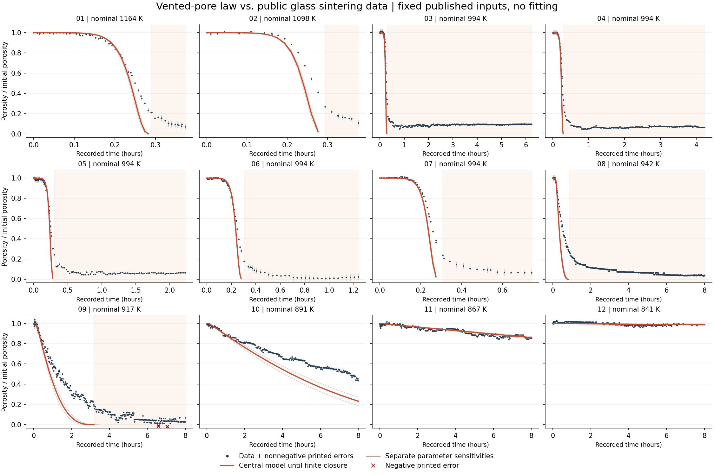
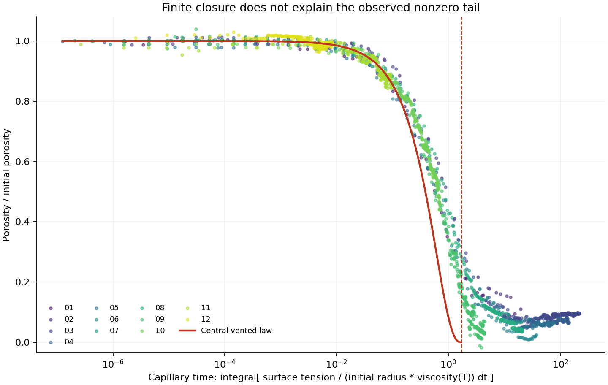

# 公开玻璃烧结数据与自由逸气孔模型的固定参数对照

**结果：方程的数值复算通过，但当前固定来源参数没有给出完整、准确的实验曲线。** 在 2283 个公开观测中，中央模型只有 1242 点仍位于正孔半径域，另 1041 点已超过其有限闭合时刻。有效域内归一化孔隙率平均绝对差为 0.06579，最大 0.39130；197/1242 点落在作者打印的 Error 范围内。Error 的置信含义及完整模型误差未给出，因此该计数仅是诊断，不构成新编的材料验收阈值。

来源为 Wadsworth 等 2016，DOI [10.1098/rspa.2015.0780](https://doi.org/10.1098/rspa.2015.0780)。从 Europe PMC 公开接口取得原始发布附件，保留 CC BY 4.0 正文、补充 PDF、XML 和 `rspa20150780supp2.txt`。这是作者处理后的数据，不是原始相机记录。12 个列组分别保留，994 K 的五组不合并、不杜撰试件编号。13698 个导入数值已逐字段对照原文件，独立抽取程序得到相同字节内容；未使用 SHA。

材料是 Spheriglass 2530 钠钙硅玻璃颗粒，不能替代 M1 黏土砖或 MIA3 含污泥配方。固定初始孔隙率 0.45 来自各样品平均值；5.9 μm 孔径由作者从颗粒粒径分布推导，并非各试样独立测量值；0.3 N/m 表面张力是论文借用的干燥硅酸盐值。没有利用这些观测重新拟合参数。

**黏度解释明确保留条件性。** 正文 p8 打印 μ=A+B/(T−C)，缺少 VFT 的对数；本比较使用明确注明的解释 log10(μ/(Pa·s))=−2.63+4303.36/(T/K−530.60)，并沿用已有 Fluegel2007 原始关系核对。2014 年版的 A、C 略有不同，仅作为独立敏感性版本。正文图2及补充图3的温度轴均存在 K 标签与刻度不符的问题；这里使用数据表明确标为 K 的逐时温度，不读图轴反推温度，不用标称恒温值代替记录值。热电偶距试样底部约 1.5 mm，不能把它视为试样内部均匀温度实测。

生产模型直接积分补充 EqS5 的无量纲形式：x=a/a_i，k=φ_i/(1−φ_i)，dx/dτ=−(1+kx³)/2，τ=Γ/a_i∫dt/μ(T)。归一化孔隙率为 x³/(1−φ_i+φ_ix³)。每段温度按相邻记录线性插值。该式在有限 τ 达到 x=0，中央条件为 τ=1.71431067656552；它与正文“仅在无限时间归零”的说法不一致。到达后不继续计算负半径、不补经验尾段。

数值核查采用 50 位独立分离变量积分、逆黏度的指数积分解析原函数、16/32 点求积以及不同容差和最大时间步长。原“仅改容差”的运行因步长上限相同产生同一轨迹，保留在 `comparison.same-step.json`；更细运行把最大无量纲步长减半。最终时间比较最大孔隙率差 1.111e−15，累计毛细时钟与独立原函数最大差 5.642e−13，闭合时刻差 7.158e−16。有限球壳力学式也在 72 个半径、初始孔隙率和温度组合上核对，最大半径速度差 6.777e−21 m/s。上述检查说明数值误差不足以解释观测偏差，不证明实际玻璃本构完整；未新增或执行软件测试。

| 数据列组 / 标称温度 K | 有模型定义的点数 | 归一化孔隙率 MAE | 最大绝对差 | 到达闭合后点数 |
|---|---:|---:|---:|---:|
| 01 / 1164 | 46 | 0.04588 | 0.27677 | 17 |
| 02 / 1098 | 20 | 0.06905 | 0.39130 | 9 |
| 03 / 994 | 46 | 0.06564 | 0.38767 | 242 |
| 04 / 994 | 46 | 0.04818 | 0.35365 | 162 |
| 05 / 994 | 47 | 0.04821 | 0.29341 | 80 |
| 06 / 994 | 43 | 0.03792 | 0.27570 | 32 |
| 07 / 994 | 42 | 0.05487 | 0.35846 | 16 |
| 08 / 942 | 58 | 0.12379 | 0.37259 | 289 |
| 09 / 917 | 146 | 0.16059 | 0.30250 | 194 |
| 10 / 891 | 254 | 0.12001 | 0.25665 | 0 |
| 11 / 867 | 250 | 0.01312 | 0.04577 | 0 |
| 12 / 841 | 244 | 0.00983 | 0.02922 | 0 |

孔径 5.37/6.43 μm、初始孔隙率 0.43/0.47 和整组 2014 VFT 系数的五个单因素敏感性版本，仍未消除总体偏快及晚期失效。不同版本的有效时间域略有差别，MAE 不用于直接排名；这些版本不是联合置信区间。正文 p12 表1另列以这些实验拟合得到的孔径 11.01±1.18 μm。它与分布推导的 5.9±0.53 μm 不同，不可替换后再声称独立预测；偏差也不能单独归因于渗透率。

**观测自身的异常同样保留。** 第09组原文件第284、303行的归一化孔隙率分别为 −0.01128、−0.01716，Error 也为负，不能解释为物理孔体积或合法对称误差幅度。另有196个归一化孔隙率高于1的点。所有原值保留；图中负 Error 点以叉号绘出，不取绝对值、不裁剪。原因需原始图像、标定或作者说明才能确定。两负值点都在中央模型闭合以后，未用于有效域误差计数。

浅色背景表示中央模型已超过正半径域；细线是不同来源参数的独立敏感性版本。PDF 版本一并提供。图形不以线条相近替代逐项误差判断。

下一步需要能够限定粒径/孔径分布、内部温度以及开放孔向封闭孔演化的证据，或在另一明确公开材料上验证这些机制。论文 Eq2.20 的非零终态修正明确是经验代换且不严格满足原推导，本阶段未将其当作第一性原理加入。`material_qualified=false`，`training_eligible=false`；未解除真实砖全过程依赖。

复现入口：`extract_wadsworth2016_sintering_data.py`、`compare_wadsworth2016_vented_pore.py`、`plot_wadsworth2016_comparison.py`；参数统一在根文件 `parameters.wadsworth2016_vented_pore.json`。处理数据及逐点比较位于 `data/sandbox/research/wadsworth2016-sintering-data-v1/`。

补充来源核查：2017 年同作者原文 DOI 10.1103/PhysRevE.95.033114，正文033114-3明确打印 log10(μ) 及同一组系数、Kelvin 温标，为上述对数解释提供直接后续文献依据。其033114-5也明确承认未调整的球孔模型普遍收缩偏快，并把后续修正称为经验拟合。详情见 [2017来源核查](../wadsworth2017-source-review-v1/REPORT.md)。

## 孔径来源追查补充

原文第7页的 Eq2.27 已包含后续2017文献同样的 `(1+ζ)` 概率归一化问题。以原文明示的单粒径极限与 Schulz m=0 分布作为数学例子、分别取三种孔隙率，六个打印多粒径式全部不能归一化；独立积分与边界概率恒等式达到60位核查预算。相反，独立的 Eq2.24 单粒径式包含常数 y3，三个例子均可归一化，不能把整节所有公式一概判错。

Eq2.26下方还打印 `a=〈ζ〉/〈R〉`，右侧单位是长度的倒数，与前文 `ζ=a/R` 不相容；维度一致的关系应是 `〈a〉=〈R〉〈ζ〉`。这些均已视觉核对原始PDF第7页，并保留在 `pore-radius-provenance.json`。没有据此自行修改公开5.9μm数值。

因此5.9±0.53μm的状态进一步明确为“作者报告的推导参数，尚未独立复算”，不是直接孔径测量或已通过来源重建的参数。当前取得的补充时间序列没有给出复算所需的实测粒径矩；数学示例不得当作该试样的粒径分布。前述固定参数对照仍有效地回答“使用作者报告值会得到什么”，不能宣称孔径来源已全面验证。新增复现入口为 `review_wadsworth2016_pore_radius.py`，参数为 `parameters.wadsworth2016_pore_radius_provenance.json`。
